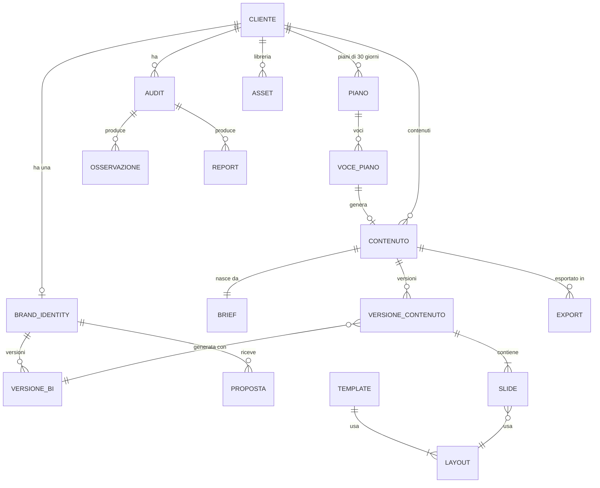
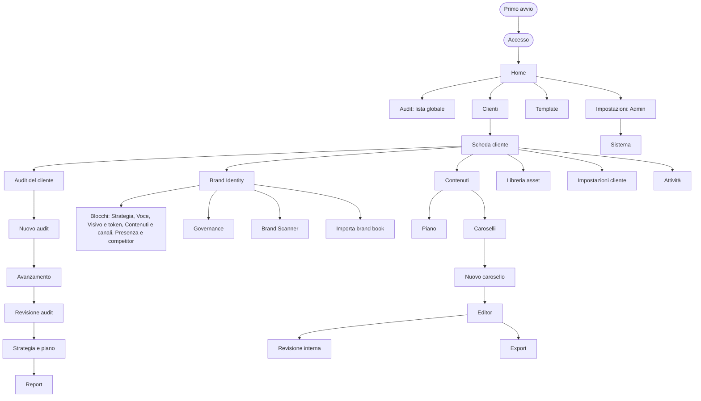
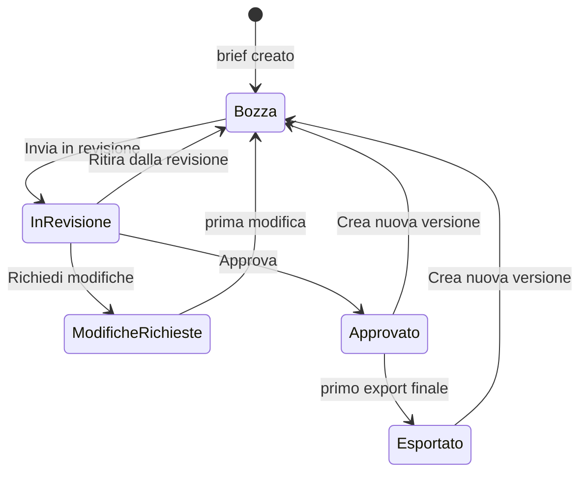

# Forgecy · UX Specification

| Campo | Valore |
| :-- | :-- |
| Documento | `UX_SPECIFICATION.md` |
| Versione | 0.1 (bozza per revisione) |
| Data | 5 ottobre 2026 |
| Stato | In revisione del Product Owner |
| Product Owner | Jacopo (decisore unico sul prodotto Forgecy) |
| Perimetro | Tutta l'esperienza d'uso di Forgecy, dal primo avvio dell'installazione all'export dei deliverable finali |
| Lettori | Product Owner, UX/UI Designer, sviluppatore frontend, sviluppatore backend, designer del design system, agente AI che implementa |

> Questo documento è autonomo: si legge senza conoscere le conversazioni che l'hanno preceduto. Le decisioni prese altrove sono riportate nella sezione [2. Assumptions and dependencies](#2-assumptions-and-dependencies). Dove un'informazione mancava ho scelto un default ragionevole, l'ho dichiarato nel punto in cui si applica con un riferimento `[UXA-nn]` e l'ho raccolto nella sezione finale [UX assumptions requiring confirmation](#24-ux-assumptions-requiring-confirmation).

## Come leggere questo documento

| Se sei | Leggi prima | Poi |
| :-- | :-- | :-- |
| Product Owner | 1, 2, 4, 24 | 8 (journey), 22 (criteri di accettazione) |
| UX/UI Designer | 4, 6, 7, 8, 9, 10 | 12, 13, 14, 15 |
| Sviluppatore frontend | 6, 7, 10, 11, 12 | 19, 22 |
| Sviluppatore backend | 11, 19 | 9 (flussi), 22 |
| Designer del design system | 15, 14, 13 | 12 (pattern), 11 (stati) |
| Agente AI che implementa | Tutto, nell'ordine; le regole marcate **DEVE** sono vincolanti | 22 come checklist di fine lavoro |

Convenzioni:

- **DEVE / NON DEVE**: requisito vincolante. **DOVREBBE**: raccomandato, si può derogare con un motivo scritto in `docs/adr/`. **PUÒ**: facoltativo.
- Fase di ogni elemento: `MVP` (milestone M1–M6), `v1` (M7), `F2` (Fase 2), `Dopo` (dopo la v1 o più avanti). Quando non è indicata, l'elemento è `MVP`.
- I testi dell'interfaccia sono tra virgolette e in italiano, come appariranno: «Approva versione».
- I percorsi delle pagine, i nomi tecnici, gli stati nel codice e gli id dei job restano in inglese e in carattere monospaziato: `/clients/:slug/contents/:id/editor`, `generate_slides`, `in_review`.
- Gli identificatori servono a collegare le parti del documento: `F-nn` flusso, `S-nn` schermata, `P-nn` pattern di interazione, `AC-nn` criterio di accettazione, `UXA-nn` assunzione da confermare.

---

## Indice

1. [Scopo e perimetro](#1-scopo-e-perimetro)
2. [Assumptions and dependencies](#2-assumptions-and-dependencies)
3. [Utenti, ruoli e permessi](#3-utenti-ruoli-e-permessi)
4. [Principi di esperienza](#4-principi-di-esperienza)
5. [Modello concettuale e glossario](#5-modello-concettuale-e-glossario)
6. [Architettura dell'informazione e navigazione](#6-architettura-dellinformazione-e-navigazione)
7. [Struttura dell'interfaccia (shell)](#7-struttura-dellinterfaccia-shell)
8. [Customer journey end-to-end](#8-customer-journey-end-to-end)
9. [Flussi dettagliati](#9-flussi-dettagliati)
10. [Specifica delle schermate](#10-specifica-delle-schermate)
11. [Stati degli oggetti](#11-stati-degli-oggetti)
12. [Pattern di interazione trasversali](#12-pattern-di-interazione-trasversali)
13. [Contenuti e microcopy](#13-contenuti-e-microcopy)
14. [Accessibilità](#14-accessibilità)
15. [Requisiti per il design system](#15-requisiti-per-il-design-system)
16. [Dimensioni dello schermo e piattaforme](#16-dimensioni-dello-schermo-e-piattaforme)
17. [Prestazioni percepite e feedback](#17-prestazioni-percepite-e-feedback)
18. [Notifiche e attività](#18-notifiche-e-attività)
19. [Requisiti per il backend che nascono dalla UX](#19-requisiti-per-il-backend-che-nascono-dalla-ux)
20. [Metriche di esperienza](#20-metriche-di-esperienza)
21. [Piano di validazione UX](#21-piano-di-validazione-ux)
22. [Criteri di accettazione UX](#22-criteri-di-accettazione-ux)
23. [Fuori perimetro](#23-fuori-perimetro)
24. [UX assumptions requiring confirmation](#24-ux-assumptions-requiring-confirmation)

---

## 1. Scopo e perimetro

### 1.1 Che cos'è Forgecy

Forgecy è uno strumento interno di un'agenzia di comunicazione, installato sulla macchina dell'agenzia (self-hosted con Docker Compose). Serve a:

1. analizzare un potenziale cliente (prospect): sito, social e competitor, con una diagnosi e un report PDF;
2. definire la Brand Identity di ogni cliente, versionata e approvata da una persona;
3. pianificare i contenuti (pilastri, rubriche, piano di 30 giorni);
4. produrre caroselli social statici coerenti con il brand, modificabili slide per slide;
5. revisionarli e approvarli internamente;
6. esportarli nei formati di consegna (PNG, PDF, ZIP con caption e hashtag).

Il flusso centrale è: **Prospect → Audit → Diagnosi → Brand Identity → Content strategy → Carosello → Revisione → Export**. Un cliente già attivo entra dalla Brand Identity.

Gli agenti AI analizzano, propongono e producono bozze. Le decisioni (approvare una Brand Identity, approvare un contenuto, consegnare un report) le prende sempre una persona dell'agenzia.

### 1.2 Obiettivo di questo documento

Descrivere in modo implementabile **che cosa vede e che cosa può fare ogni utente** in ogni momento, con stati, errori, permessi e testi, così che design, frontend e backend costruiscano la stessa cosa senza dover chiedere.

### 1.3 Obiettivi di esperienza

| ID | Obiettivo | Misura (vedi sezione 20) |
| :-- | :-- | :-- |
| G-1 | Un Account produce la prima bozza di un carosello da 7 slide coerente col brand in meno di 2 minuti di attesa di sistema | Tempo tra «Approva scaletta e genera slide» e editor pronto |
| G-2 | Ogni slide si corregge a mano o con un'istruzione all'AI senza rigenerare le altre | Percentuale di modifiche AI su singola slide tenute al primo tentativo |
| G-3 | Ogni osservazione di un audit consegnato mostra la sua evidenza | Zero osservazioni senza evidenza nei report esportati |
| G-4 | Chi apre una schermata capisce in 5 secondi su quale cliente lavora, in che stato è l'oggetto e chi deve agire | Test dei 5 secondi (sezione 21) |
| G-5 | Nessun file finale esce con font o colori fuori dalla Brand Identity, o senza approvazione | Export finali tutti legati a una versione approvata |
| G-6 | Nessuna azione dell'AI cambia qualcosa senza traccia o senza possibilità di annullarla | Ogni azione AI ha una voce in cronologia e un annulla |

### 1.4 Perimetro per fase

| Area | MVP (M1–M6) | v1 (M7) | Dopo |
| :-- | :-- | :-- | :-- |
| Installazione e primo avvio | Setup guidato dell'Admin, stato dei servizi | Aggiornamento guidato con note di rilascio | — |
| Accesso | Account locali creati dall'Admin, password | Magic link e Google OAuth (modalità team), inviti, sospensione | — |
| Prospect e audit | Wizard, avanzamento, revisione, diagnosi, piano di 30 giorni, report PDF completo e compatto, testo per email | Caroselli dimostrativi nel report, confronto tra due audit | PPTX, link condivisibile, versione per il pitch |
| Brand Identity | Editor a blocchi, proposte AI, Approva e pubblica, versioni, ripristino, import brand book, Brand Scanner | Confronto versioni, Creative Director AI, deleghe per cliente, Brand Book PDF, Brand System ZIP | Sotto-brand, pubblicazione programmata |
| Contenuti | Piano, wizard carosello, editor, immagini AI statiche, Brand Guard, commenti, revisione interna, export | Chat nell'editor, versioni a confronto, approvazione per slide, menzioni, batch, formati 1:1, 9:16, FB 4:5, TikTok | Calendario e pubblicazione (F2) |
| Template | Catalogo, import del pacchetto, anteprima, pubblicazione, assegnazione | Template per rubrica | — |
| Impostazioni | Utenti, ruoli (sola lettura), provider AI, budget, email, backup, Sistema | Permessi per cliente, agenti configurabili | — |
| Tema | Solo chiaro | Scuro | — |

Il video non esiste in nessuna fase: nessuna schermata, voce di menu o pulsante deve suggerirlo.

---

## 2. Assumptions and dependencies

Questa sezione elenca le decisioni prese fuori da questo documento da cui la UX dipende. Sono date per buone; se una cambia, le sezioni indicate vanno riviste.

### 2.1 Fonti

| ID | Fonte | Cosa contiene |
| :-- | :-- | :-- |
| SRC-1 | Scheda tecnica di Forgecy, tab principale (documento interno, revisione del 5 ottobre 2026) | Perimetro, ruoli, flussi, funzionalità per fase, Audit, UX/UI di alto livello, architettura, modello dati, AI, sicurezza, roadmap |
| SRC-2 | Scheda tecnica, tab «Brand Identity», parte 1 | Modello della Brand Identity dei clienti, governance, permessi, proposte, stati, schermate |
| SRC-3 | Scheda tecnica, tab «Brand Identity», parte 2 «Identità visiva di Forgecy» | Palette, tipografia, icone, logo, token e regole di accessibilità dell'interfaccia di Forgecy |
| SRC-4 | `README.md` del repository | Descrizione pubblica del flusso del carosello |
| SRC-5 | Analisi di Creads caricata nel progetto | Solo riferimento di flusso (Brand DNA, brief in linguaggio naturale, memoria delle correzioni); nessuna funzione di Creads entra per il solo fatto di esistere lì |

### 2.2 Decisioni di prodotto da cui dipende la UX

| ID | Decisione | Fonte | Impatto sulla UX | Sezioni |
| :-- | :-- | :-- | :-- | :-- |
| D-01 | Self-hosted con Docker Compose, nessun servizio cloud obbligatorio | SRC-1 | Esiste un primo avvio da guidare; backup e stato dei servizi sono visibili all'Admin | 9.1, S-00, S-27 |
| D-02 | 3–8 utenti interni; nessun accesso per clienti o esterni in v1 | SRC-1 | Nessuna pagina pubblica nell'MVP; la revisione cliente via link firmato è `Dopo` | 3, 23 |
| D-03 | Ruoli Admin, Strategist, Designer, Account, Reviewer, Viewer, con permessi separati | SRC-1, SRC-2 | Ogni azione ha un permesso; l'interfaccia nasconde o disattiva ciò che il ruolo non può fare | 3, P-11 |
| D-04 | Product Owner (attributo `is_product_owner`) distinto da Admin; decide su prodotto, agenti, layout di sistema, policy | SRC-2 | Le impostazioni di piattaforma sono visibili solo al Product Owner | 3.3, S-26 |
| D-05 | Gli agenti AI non approvano, non pubblicano, non archiviano: solo proposte | SRC-2 | Pattern unico per le proposte AI; nessun pulsante di approvazione legato a un agente | 4, P-03 |
| D-06 | Flusso dei contenuti: Bozza → In revisione interna → Approvato → Esportato; Modifiche richieste riporta a Bozza | SRC-1 | Macchina a stati e badge dei contenuti | 11.1 |
| D-07 | L'export finale si sblocca solo dopo l'approvazione interna; prima solo anteprima con la scritta «Bozza» | SRC-1 | Gate nella schermata Export | 9.14, S-23 |
| D-08 | Brand Guard suggerisce e non blocca; chi approva deve confermare gli avvisi | SRC-1 | Pannello Controlli, conferma degli avvisi in approvazione | 9.11, 9.13 |
| D-09 | Slide come JSON strutturato su layout predefiniti; l'AI riempie slot, non scrive HTML | SRC-1 | L'editor modifica blocchi in slot, non HTML libero | 9.11 |
| D-10 | Un unico renderer per anteprima ed export: ciò che si vede è ciò che si esporta | SRC-1 | Anteprima in pixel reali scalata, identica al file | 9.11, 9.14 |
| D-11 | Lavori lunghi in coda (BullMQ) con stato persistente e avanzamento via Server-Sent Events | SRC-1 | Pattern unico per job e avanzamento | P-01 |
| D-12 | Lock del contenuto durante i job AI ed export; salvataggio con numero di revisione della bozza (`draft_rev`) | SRC-1 | Editor in sola lettura durante i job; dialog di conflitto | P-06, P-07 |
| D-13 | Policy di riservatezza AI per cliente: `external_allowed`, `external_restricted`, `local_only`, `no_ai` | SRC-1 | Indicatore di policy, conferme e blocchi | P-09 |
| D-14 | Budget AI per agenzia e cliente: avviso al 70%, blocco al 100%; conferma al 90% in v1 | SRC-1 | Banner e blocchi di budget | P-10 |
| D-15 | Immagini AI statiche nell'MVP: generazione separata dal render, 1–4 varianti, l'immagine resta bozza finché una persona non la approva; solo immagini approvate nell'export | SRC-1 | Pannello Immagini e stato delle immagini | 9.12 |
| D-16 | Provider di immagini con stato d'uso commerciale `pending_verification` finché il Product Owner non verifica i termini; fino ad allora non si usa con clienti reali | SRC-1 | Generazione immagini non disponibile finché il provider non è verificato | 9.12, `UXA-21` |
| D-17 | Formati in ordine di rilascio: Instagram 4:5 e LinkedIn documento (MVP), poi Instagram 1:1, Stories 9:16, Facebook 4:5, TikTok carosello foto (v1) | SRC-1 | Selettore formato; i formati non ancora disponibili non compaiono | 9.10 |
| D-18 | Audit nell'MVP: input, raccolta, analisi per area, diagnosi di 3–5 problemi, revisione umana, piano di 30 giorni, report PDF sul template dell'agenzia | SRC-1 | Sei schermate dell'Audit | 9.4–9.7 |
| D-19 | Dati social dei prospect solo da screenshot, CSV/XLSX, inserimento manuale o documenti; nessuno scraping; nessuna metrica stimata presentata come certa | SRC-1 | Wizard di raccolta dati con fonte su ogni metrica | 9.4 |
| D-20 | Brand Identity versionata: versione `draft`, `in_review`, `approved`, `published`, `archived`; proposte `proposed`, `accepted`, `rejected`, `stale`; categorie sensibili accettate una per una | SRC-2 | Governance, coda delle proposte | 9.9 |
| D-21 | Confidenza alta/media/bassa calcolata dalle fonti, mai numeri dichiarati dal modello | SRC-2 | Badge di confidenza | P-04 |
| D-22 | «Approva e pubblica» richiede un changelog; ripristino = nuova bozza copiata dalla versione scelta | SRC-2 | Dialog di pubblicazione e cronologia | 9.9 |
| D-23 | L'Account modifica la bozza della Brand Identity solo in Strategia, Voce, Contenuti e canali; non logo e token | SRC-2 | Campi in sola lettura per l'Account nel blocco Visivo | 3, 9.9 |
| D-24 | Interfaccia in italiano; nomi tecnici in inglese e in monospaziato; contenuti generati nella lingua del brief | SRC-1, SRC-3 | Microcopy in italiano; selettore della lingua del contenuto | 13 |
| D-25 | Identità visiva di Forgecy: palette Forge Blue, Porcelain, Graphite; Space Grotesk, Inter, JetBrains Mono; icone Lucide; tema chiaro nell'MVP | SRC-3 | Design system | 15 |
| D-26 | Desktop-first, larghezza minima 1280 px | SRC-1 | Comportamento responsive | 16 |
| D-27 | Template dell'agenzia nel formato canonico HTML + CSS + `template.json`; Figma, Canva, PDF e PNG sono solo riferimenti | SRC-1 | La creazione di un template è un import di pacchetto, non un costruttore visuale | 9.8, `UXA-15` |
| D-28 | Report dell'audit e Brand Book per i clienti usano il template e il marchio dell'agenzia, mai quello di Forgecy | SRC-3 | Anteprima del report con il brand dell'agenzia | 9.7 |
| D-29 | Memoria per cliente e progetto: regole attive solo dopo conferma umana; impostazioni strutturate (numero di slide, formato, lingua, CTA) come valori, non frasi | SRC-1 | Sezione Regole, impostazioni predefinite del cliente | 9.3, 9.11 |
| D-30 | Video escluso da ogni fase | SRC-1 | Nessun elemento video | 23 |

### 2.3 Dipendenze tecniche che la UX presuppone

| ID | Dipendenza | Perché serve alla UX |
| :-- | :-- | :-- |
| T-01 | Endpoint SSE `GET /api/jobs/:id/events` con eventi di avanzamento per passo e per slide | Avanzamento slide per slide e passo per passo (P-01) |
| T-02 | Ogni risposta delle API che restituisce un oggetto modificabile include le azioni permesse all'utente corrente (19.2) | L'interfaccia non ricalcola i permessi |
| T-03 | Salvataggio della bozza con `draft_rev` e risposta di conflitto (HTTP 409) con autore e ora dell'ultima revisione | Dialog di conflitto (P-07) |
| T-04 | Stato persistente dei job (`queued`, `running`, `completed`, `failed`, `retrying`, `cancelled`, `needs_attention`) letto dal database | L'interfaccia mostra lo stato del job, mai la presenza di un file |
| T-05 | Renderer unico raggiungibile dall'editor per l'anteprima | Anteprima identica all'export |
| T-06 | Brand Guard esegue controlli sul JSON (immediati) e sul render (asincroni) | Due tempi di aggiornamento nel pannello Controlli |
| T-07 | `jobs_log` con provider, modello, policy e costo di ogni chiamata AI | Indicatori di policy e consumo |
| T-08 | Link firmati agli export validi 24 ore | Scadenza dei download |
| T-09 | `audit_events` con autore (persona o agente), azione, oggetto, ora | Registro attività e cronologie |

### 2.4 Contraddizioni trovate nelle fonti e come le risolvo

| ID | Contraddizione | Risoluzione adottata in questo documento |
| :-- | :-- | :-- |
| C-1 | SRC-1 (UX/UI) prevede tema chiaro e scuro e Inter come unico font; SRC-3 limita l'MVP al tema chiaro e usa Space Grotesk per i titoli | Prevale SRC-3, più recente e specifico: tema chiaro nell'MVP, scuro in v1; Space Grotesk, Inter, JetBrains Mono |
| C-2 | SRC-1 elenca «Login Google» nell'MVP; altrove dice che l'MVP parte con account locali e che Google OAuth e magic link arrivano in v1 | L'MVP consegna l'accesso con password e account creati dall'Admin; la schermata di accesso è progettata per mostrare anche magic link e Google quando la modalità team è attiva (v1). `UXA-03` |
| C-3 | SRC-2 dice che il Reviewer (agente) «può bloccare un export»; SRC-1 dice che i controlli non bloccano l'export | Brand Guard non blocca; il blocco dell'export finale è l'approvazione umana (D-07). Gli errori di Brand Guard vanno confermati da chi approva. `UXA-12` |
| C-4 | SRC-1 (UX/UI) ha «Approvazioni» come voce del cliente; SRC-3 non la mette nella navigazione | La coda di revisione è in Home («In attesa di me») e come vista filtrata in Contenuti; nessuna voce di menu dedicata. `UXA-06` |
| C-5 | SRC-3 parla di «selettore cliente e progetto» nella barra in alto; il modello dati non ha un oggetto «progetto» separato dal contenuto | La barra in alto ha il selettore cliente; il «progetto» è il contenuto o l'audit aperto e compare nel percorso (breadcrumb). `UXA-05` |

---

## 3. Utenti, ruoli e permessi

### 3.1 Persone tipo

Le persone qui sotto sono ricavate dai ruoli della scheda tecnica, non da ricerca con utenti. Vanno verificate con il piano della sezione 21.

| Ruolo | Chi è | Obiettivo principale | Momento di massima tensione | Cosa gli serve dall'interfaccia |
| :-- | :-- | :-- | :-- | :-- |
| Admin | Titolare o responsabile tecnico | Che l'agenzia lavori senza intoppi e senza sorprese su costi e dati | Un lavoro fallito o il budget al limite mentre un collega aspetta | Stato del sistema, costi, utenti, approvazione finale delle Brand Identity |
| Account | Account manager o social media manager | Consegnare caroselli e audit in tempo | La bozza deve uscire prima di una call | Brief veloce, generazione affidabile, modifica rapida della singola slide, export pronto |
| Strategist | Stratega o planner | Una diagnosi credibile e una strategia solida | Il prospect chiede «perché dite questo?» | Evidenze, fonti, controllo su osservazioni e problemi |
| Designer | Grafico o art director | Che tutto sia coerente con il brand e curato | Una slide esce fuori brand | Token, template, matrice del contrasto, Brand Guard |
| Reviewer | Creativo senior o revisore | Approvare solo ciò che è pronto | Approvare in fretta senza vedere un errore | Slide grandi in sequenza, avvisi evidenti, commenti per slide |
| Viewer | Chi consulta | Trovare un contenuto o un report | — | Ricerca e sola lettura chiara |
| Product Owner | Attributo separato dai ruoli (oggi Jacopo) | Decidere su prodotto, agenti, policy | — | Impostazioni di piattaforma |

### 3.2 Matrice dei permessi che cambiano l'interfaccia

Legenda: ✔ può · ◐ può in parte (nota) · — non può. I permessi sono assegnati ai ruoli (`role_permissions`); in v1 si delegano per cliente (`permission_grants`). L'interfaccia legge sempre le azioni permesse dal server (19.2), non da questa tabella.

| Azione (permesso) | Admin | Strategist | Designer | Account | Reviewer | Viewer |
| :-- | :-: | :-: | :-: | :-: | :-: | :-: |
| Vedere clienti, contenuti, audit | ✔ | ✔ | ✔ | ✔ | ✔ | ✔ |
| Creare prospect e clienti (`project.edit`) | ✔ | ✔ | ✔ | ✔ | — | — |
| Creare e condurre un audit | ✔ | ✔ | ✔ | ✔ | — | — |
| Rivedere le osservazioni di un audit | ✔ | ✔ | ✔ | ✔ | — | — |
| Esportare il report dell'audit (`reports.export`) | ✔ | ✔ | ✔ | ✔ | — | — |
| Proporre modifiche alla Brand Identity (`brand_identity.propose`) | ✔ | ✔ | ✔ | ✔ | — | — |
| Modificare la bozza della Brand Identity (`brand_identity.edit_draft`) | ✔ | ◐ come Account `UXA-08` | ✔ | ◐ solo Strategia, Voce, Contenuti e canali | — | — |
| Rivedere proposte (`brand_identity.review`) | ✔ | ✔ `UXA-08` | ✔ | ✔ | — | — |
| Approvare, pubblicare, archiviare una Brand Identity | ✔ | — | — | — | — | — |
| Caricare asset (`assets.upload`) | ✔ | ✔ | ✔ | ✔ | — | — |
| Creare e modificare contenuti | ✔ | ✔ | ✔ | ✔ | — | — |
| Inviare in revisione interna | ✔ | ✔ | ✔ | ✔ | — | — |
| Approvare o richiedere modifiche a un contenuto | ✔ | ✔ | ✔ | — | ✔ | — |
| Esportare un contenuto approvato | ✔ | ✔ | ✔ | ✔ | — | — |
| Gestire template (`templates.manage`) | ✔ | — | ✔ | — | — | — |
| Approvare un'immagine AI | ✔ | ✔ | ✔ | ✔ `UXA-20` | ✔ | — |
| Cambiare la policy AI di un cliente | ✔ | — | — | — | — | — |
| Utenti, provider AI, budget, email, backup, Sistema | ✔ | — | — | — | — | — |
| Impostazioni di piattaforma (agenti, layout di sistema, policy predefinite) | solo chi ha `is_product_owner`, qualunque ruolo | | | | | |

Regole:

- Il ruolo Strategist non ha una colonna nella tabella dei permessi della Brand Identity in SRC-2. Assumo gli stessi permessi dell'Account sulla bozza, più la revisione delle proposte. `UXA-08`
- Chi ha inviato un contenuto in revisione non può approvarlo; l'Admin può farlo con una nota obbligatoria. `UXA-11`
- Un agente AI non compare mai come autore di un'approvazione, di una pubblicazione o di un'archiviazione.

### 3.3 Product Owner

- È un attributo dell'utente, non un ruolo. Il primo Admin creato al primo avvio riceve l'attributo. `UXA-02`
- Vede la sezione «Piattaforma» nelle Impostazioni. Non approva automaticamente le Brand Identity dei clienti: per quelle serve il permesso di approvazione, come per chiunque.
- Nell'interfaccia l'attributo è visibile come badge «Product Owner» accanto al nome nella lista utenti.

---

## 4. Principi di esperienza

Ogni principio ha una regola verificabile. Quando due principi sembrano in conflitto, vale l'ordine della tabella.

| # | Principio | Regola verificabile |
| :-- | :-- | :-- |
| 1 | **Le persone decidono, l'AI propone.** | Nessun testo dice che l'AI «ha deciso», «ha approvato», «ha capito». Ogni contributo dell'AI ha l'aspetto di proposta (P-03) oppure crea un passo annullabile (P-05). |
| 2 | **Ogni affermazione mostra da dove viene.** | Osservazioni, proposte e metriche hanno fonte, data di acquisizione e confidenza visibili senza cambiare pagina (P-04). Un'osservazione senza evidenza non si salva. |
| 3 | **Il cliente è sempre chiaro.** | In ogni schermata dentro un cliente, nome e logo del cliente sono visibili nella barra in alto senza scorrere. |
| 4 | **Sei domande senza scorrere.** | Ogni schermata di lavoro risponde, nella parte visibile al caricamento a 1440 × 900: su quale cliente e oggetto sto lavorando; in che stato è; chi deve fare la prossima azione; che cosa ha proposto l'AI e su quali fonti; che cosa cambia se approvo; che cosa blocca l'export. |
| 5 | **Ciò che vedi è ciò che esporti.** | L'anteprima dell'editor usa lo stesso renderer dell'export, in pixel reali scalati. Nessuna anteprima «indicativa». |
| 6 | **Avvisare, non ostacolare; bloccare solo dove serve una persona.** | Brand Guard non blocca nessuna azione. Bloccano solo: export finale senza approvazione, budget esaurito, policy AI violata, permesso mancante. Ogni blocco dice perché e che cosa fare. |
| 7 | **L'attesa si vede, passo per passo.** | Nessuno spinner unico per un lavoro che dura più di 2 secondi: si mostrano i passi (audit) o le slide (carosello) man mano che arrivano. |
| 8 | **Niente si perde.** | Salvataggio automatico con conferma visibile; conflitti segnalati invece di sovrascrivere; versioni approvate immutabili; ripristino sempre possibile come nuova bozza. |
| 9 | **Il colore dice qualcosa.** | Interfaccia neutra: i colori dei brand dei clienti risaltano nelle anteprime; il colore di Forgecy indica azione o stato e non è mai l'unico segnale (icona ed etichetta sempre presenti). |
| 10 | **Mostrare solo ciò che esiste.** | Nessuna voce di menu, pulsante o formato per funzioni non ancora rilasciate. Niente «Prossimamente». |
| 11 | **Un'azione principale per area.** | Al massimo un pulsante primario (Forge Blue) visibile per area della schermata; le altre azioni sono secondarie o nel menu. |
| 12 | **Pulsanti con verbo e oggetto.** | «Approva versione», «Genera slide», «Esporta ZIP»; mai «OK» o «Continua» da soli. Nei wizard «Avanti» è seguito dal nome del passo successivo: «Avanti: competitor». |

Metodi applicati: progressive disclosure (il dettaglio compare solo quando serve), goal gradient (la pipeline in alto mostra quanto manca alla fine del flusso), peak-end (cura particolare per la generazione, che è il picco, e per l'export, che è la fine), riduzione della scelta (default sensati invece di molte opzioni).

---

## 5. Modello concettuale e glossario

### 5.1 Oggetti e relazioni



### 5.2 Glossario dell'interfaccia

I termini a sinistra sono quelli che l'interfaccia DEVE usare, sempre uguali. La colonna «Non usare» evita sinonimi che confondono.

| Termine nell'interfaccia | Significato | Nel codice | Non usare |
| :-- | :-- | :-- | :-- |
| Cliente | Un'azienda per cui l'agenzia lavora o vorrebbe lavorare | `clients` | Account (è un ruolo), brand |
| Prospect | Cliente con stato «prospect», non ancora firmato | `clients.status = prospect` | Lead, potenziale |
| Audit | Analisi di sito, social e competitor di un cliente o prospect | `audits` | Analisi (generico), scansione |
| Osservazione | Un fatto rilevato dall'audit, con evidenza | `audit_findings.kind = observation` | Insight, finding |
| Problema principale | Una delle 3–5 sintesi della diagnosi | `audit_findings.kind = problem` | Issue |
| Evidenza | La prova di un'osservazione: pagina, screenshot, post, citazione o ritaglio | `evidence` | — |
| Fonte | Da dove arriva un dato (sito, screenshot, CSV, documento, inserimento manuale, inferenza AI) | `method`, `brand_sources` | Origine |
| Report | Il documento PDF dell'audit sul template dell'agenzia | `audit_reports` | Presentazione |
| Brand Identity | L'insieme versionato di strategia, voce, identità visiva, contenuti e canali di un cliente | `brand_identities` | Brand kit, Brand DNA |
| Versione | Una fotografia numerata della Brand Identity o di un contenuto | `*_versions` | Revisione (è l'atto di rivedere) |
| Bozza | La versione in lavorazione, modificabile | `draft` | Draft |
| Proposta | Una modifica suggerita (da agente o persona) in attesa di decisione | `brand_identity_proposals` | Suggerimento |
| Superata | Proposta non più applicabile perché il campo è cambiato nel frattempo | `stale` | Obsoleta, scaduta |
| Pubblicata | La versione corrente della Brand Identity, usata dalle generazioni | `published` | Attiva, live |
| Contenuto | Un carosello (in futuro altri formati statici) | `contents` | Post, progetto |
| Carosello | Contenuto multi-slide | `contents.type = carousel` | Slideshow |
| Brief | La richiesta da cui nasce un contenuto | `briefs` | Prompt |
| Scaletta | La struttura testuale del carosello prima delle slide | `briefs.outline` | Outline, struttura |
| Slide | Una pagina del carosello | — | Pagina, card |
| Blocco | Un elemento della slide in uno slot del layout (titolo, testo, immagine, elenco, numero) | slot | Elemento, componente |
| Layout | La disposizione di una slide (copertina, testo, elenco, citazione, dato, problema-soluzione, confronto, CTA) | `layouts` | Template (è un'altra cosa) |
| Template | Un insieme di layout, regole e stile per un formato e un canale | `templates` | Tema, modello |
| Formato | Canale + proporzione (es. Instagram 4:5) | `format` | Misura, size |
| Asset | File nella libreria del cliente: logo, font, immagine | `assets` | Media, risorsa |
| Brand Guard | I controlli automatici di coerenza con il brand | — | Validatore, QA |
| Errore / Avviso / Nota | Esiti di Brand Guard: l'errore è un problema certo, l'avviso un probabile problema, la nota un'informazione | `severity` | Warning |
| Revisione interna | Il passaggio in cui un collega approva o chiede modifiche | `in_review` | Review |
| Export | Il file finale scaricabile | `exports` | Download, render |
| Lavoro in corso | Un job visibile all'utente | `jobs_log` | Job, task |
| Piano | Pilastri e piano editoriale di 30 giorni | `content_plans` | Calendario (è Fase 2) |
| Pilastro | Tema strategico ricorrente | `pillars` | Categoria |
| Rubrica | Serie ricorrente dentro un pilastro | `rubrics` | Format |
| Regola | Indicazione di brand o di progetto, attiva solo dopo conferma | `memory_items` | Memoria, istruzione |

---

## 6. Architettura dell'informazione e navigazione

### 6.1 Mappa



### 6.2 Navigazione principale (barra laterale)

| Ordine | Voce | Icona Lucide | Ambito | Visibile a | Fase |
| :-- | :-- | :-- | :-- | :-- | :-- |
| 1 | Home | `house` `UXA-07` | Globale | Tutti | MVP |
| 2 | Audit | `scan-search` | Globale (tutti i clienti) | Tutti | MVP (M2) |
| 3 | Clienti | `building-2` | Globale | Tutti | MVP (M1) |
| 4 | Brand Identity | `fingerprint` | Cliente selezionato | Tutti | MVP (M4) |
| 5 | Contenuti | `gallery-horizontal` | Cliente selezionato | Tutti | MVP (M5) |
| 6 | Template | `layout-template` | Globale, filtrabile per cliente | Tutti (modifica con `templates.manage`) | MVP (M3) |
| 7 | Impostazioni | `settings` `UXA-07` | Globale | Admin e Product Owner | MVP (M1) |
| — | Agenti, Automazioni, Brand Book | — | — | — | v1, non mostrate nell'MVP |

Regole:

- «Brand Identity» e «Contenuti» lavorano sul cliente selezionato nella barra in alto. Se nessun cliente è selezionato, la pagina mostra un selettore a tutta pagina («Scegli un cliente per vedere la sua Brand Identity») con gli ultimi 5 clienti aperti e la ricerca.
- La voce attiva ha una linea di selezione da 2 px in Forge Blue a sinistra e il testo in grassetto.
- Accanto a «Home» c'è un contatore degli elementi «In attesa di me» (badge Amber con testo Deep Graphite) quando è maggiore di zero.
- La barra laterale si comprime a sole icone (con tooltip e `aria-label`) con il pulsante in basso o con il tasto `[`; lo stato si ricorda nel browser dell'utente.
- Una milestone rilascia la sua voce di menu solo quando la funzione esiste (principio 10): durante lo sviluppo una voce non pronta non si mostra.

### 6.3 Navigazione dentro il cliente

La scheda cliente (S-10) ha schede orizzontali: «Panoramica», «Audit», «Brand Identity», «Contenuti», «Asset», «Attività», «Impostazioni». «Brand Identity» e «Contenuti» portano alle stesse pagine delle voci di menu omonime con il cliente già selezionato: non esistono due versioni della stessa pagina.

### 6.4 Barra della pipeline

Nelle pagine di un prospect o di un cliente compare sotto la barra in alto la pipeline del flusso: Prospect, Audit, Diagnosi, Brand Identity, Strategia, Carosello, Revisione, Export. È insieme navigazione e indicatore di avanzamento:

- nodo pieno: passo in cui si trova la pagina aperta; nodo con spunta: passo completato almeno una volta per questo cliente; nodo vuoto: non ancora iniziato; linee tratteggiate tra i nodi;
- ogni nodo è cliccabile e porta alla pagina relativa; un passo non disponibile (es. Diagnosi senza audit) è disattivato con un tooltip che dice perché;
- per un cliente attivo senza audit i primi tre nodi sono grigi con l'etichetta «Saltato» e non contano come mancanti;
- la pipeline è nascosta nell'editor e nella revisione per lasciare spazio alla slide `UXA-09`.

### 6.5 Percorsi (route)

I percorsi sono in inglese, come gli altri nomi tecnici (D-24). Ogni oggetto ha un indirizzo stabile che si può incollare a un collega.

| Percorso | Schermata | Note |
| :-- | :-- | :-- |
| `/setup` | S-00 Primo avvio | Solo se non esiste un Admin; altrimenti reindirizza a `/login` |
| `/login`, `/login/check-email`, `/login/magic/:token` | S-01 Accesso | Magic link in v1 |
| `/` | S-02 Home | |
| `/audits` | S-03 Lista audit | |
| `/audits/new` | S-04 Nuovo audit | `?client=:slug` per un cliente esistente |
| `/clients/:slug/audits/:id` | S-05 Avanzamento | |
| `/clients/:slug/audits/:id/review` | S-06 Revisione audit | |
| `/clients/:slug/audits/:id/plan` | S-07 Strategia e piano | |
| `/clients/:slug/audits/:id/report` | S-08 Report | |
| `/clients` | S-09 Lista clienti | `?status=prospect|active|archived` |
| `/clients/new` | S-09, dialog | Dialog sopra la lista |
| `/clients/:slug` | S-10 Scheda cliente | |
| `/clients/:slug/settings` | S-11 Impostazioni cliente | |
| `/clients/:slug/brand/scan` | S-12 Brand Scanner | |
| `/clients/:slug/brand/import` | S-13 Importa brand book | |
| `/clients/:slug/brand/:block` | S-14 Brand Identity | `block` = `strategy`, `voice`, `visual`, `content`, `presence` |
| `/clients/:slug/brand/governance` | S-15 Governance | |
| `/clients/:slug/assets` | S-16 Libreria asset | |
| `/clients/:slug/contents` | S-17 Lista contenuti | Filtri in query string |
| `/clients/:slug/contents/plan` | S-18 Piano | |
| `/clients/:slug/contents/new` | S-19 Nuovo carosello | `?planItem=:id` precompila il brief |
| `/clients/:slug/contents/:id/editor` | S-20 Editor | `?slide=n` apre la slide n |
| `/clients/:slug/contents/:id/review` | S-22 Revisione interna | |
| `/clients/:slug/contents/:id/export` | S-23 Export | |
| `/templates`, `/templates/:id` | S-24, S-25 | |
| `/settings/:section` | S-26 Impostazioni | `users`, `roles`, `ai`, `budgets`, `email`, `access`, `backup`, `platform` |
| `/system` | S-27 Sistema | Admin |
| `/activity` | S-28 Attività globale | Admin |
| `/design` | S-30 Pagina interna del design system | Admin e ambiente di sviluppo |

### 6.6 Ricerca

Una ricerca globale (campo nella barra in alto, scorciatoia `Ctrl+K` o `⌘K`) trova clienti, contenuti, audit e template per nome. I risultati sono raggruppati per tipo e mostrano stato e cliente. Nell'MVP la ricerca è per nome e titolo, non semantica `UXA-10`. Con il campo vuoto la ricerca mostra gli ultimi 8 oggetti aperti dall'utente.

---

## 7. Struttura dell'interfaccia (shell)

### 7.1 Regioni

```
┌──────────────────────────────────────────────────────────────────────────────┐
│ Barra in alto (56 px): logo · selettore cliente · percorso · ricerca ·       │
│ lavori in corso · utente                                                     │
├──────────┬───────────────────────────────────────────────┬───────────────────┤
│ Barra    │ Pipeline (40 px, solo nelle pagine cliente)   │                   │
│ laterale ├───────────────────────────────────────────────┤  Inspector        │
│ 240 px   │                                               │  (320 px,         │
│ (64 px   │  Area di lavoro                               │  facoltativo,     │
│ compressa)│ intestazione della pagina: titolo, stato,    │  a schede)        │
│          │ prossima azione, azioni                       │                   │
│          │                                               │                   │
└──────────┴───────────────────────────────────────────────┴───────────────────┘
```

| Regione | Contenuto | Regole |
| :-- | :-- | :-- |
| Barra in alto | Logomark di Forgecy con badge di ambiente («Internal», «Staging») se configurato; selettore cliente (logo, nome, stato prospect/attivo); percorso (es. «Rossi Srl › Contenuti › Carosello lancio autunno»); ricerca; indicatore «Lavori in corso» con contatore; menu utente (nome, ruolo, «Esci») | Sempre visibile, anche nell'editor. Il selettore cliente non compare nelle pagine globali (Home, Audit, Clienti, Template, Impostazioni) se nessun cliente è stato scelto |
| Barra laterale | Navigazione principale (6.2) | Comprimibile |
| Pipeline | Vedi 6.4 | Solo pagine di cliente e prospect, non nell'editor |
| Intestazione della pagina | Titolo (heading-lg), badge di stato, riga «Prossima azione: …» con chi la deve fare, azioni (una primaria al massimo) | Sempre in cima all'area di lavoro; resta fissa quando si scorre se la pagina supera l'altezza dello schermo |
| Area di lavoro | Contenuto della pagina | Griglia a 12 colonne, gutter 24 px, margini 32 px |
| Inspector | Proprietà, fonti, proposte AI, cronologia dell'oggetto selezionato | Presente dove serve (Brand Identity, Revisione audit, Editor); si chiude con `Esc` quando ha il focus o con il pulsante; a 1280–1439 px è chiuso per default |

### 7.2 Riga «Prossima azione»

Ogni oggetto con un flusso (audit, versione della Brand Identity, contenuto) mostra sotto il titolo una riga con: chi deve agire (nome o ruolo), che cosa deve fare, e un pulsante se la persona è l'utente corrente. Esempi:

- «Prossima azione: tu · Conferma i competitor proposti» con pulsante «Conferma competitor».
- «Prossima azione: un revisore · Approva o chiedi modifiche» (nessun pulsante per l'autore).
- «Nessuna azione in sospeso · Esportato il 4 ottobre da Giulia».

La riga risponde a «chi deve fare la prossima azione?» (principio 4) e alimenta «In attesa di me» in Home.

### 7.3 Indicatore «Lavori in corso»

Nella barra in alto un'icona con contatore mostra i lavori dell'utente in coda o in esecuzione (generazioni, audit, export, import). Al clic apre un pannello con un elemento per lavoro: tipo, oggetto, cliente, passo corrente, barra di avanzamento a passi, «Apri» e, se previsto, «Annulla». I lavori completati restano nel pannello per 24 ore con l'esito; quelli falliti restano finché l'utente non li apre. Vedi P-01.

---

## 8. Customer journey end-to-end

### 8.1 Il percorso completo

```mermaid
flowchart LR
    A([Installazione]) --> B[Primo avvio: crea Admin]
    B --> C[Accesso]
    C --> D[Home]
    D --> E{Nuovo lavoro?}
    E -->|Prospect| F[Nuovo audit]
    F --> G[Analisi in corso]
    G --> H{Conferma competitor}
    H --> G
    G --> I[Revisione audit]
    I --> J[Strategia e piano]
    J --> K[Report PDF al prospect]
    K --> L{Il prospect firma?}
    L -->|No| M([Audit archiviato])
    L -->|Sì| N[Converti in cliente]
    E -->|Cliente esistente senza audit| O[Brand Scanner o Importa brand book]
    N --> P[Governance: rivedi proposte]
    O --> P
    P --> Q[Approva e pubblica Brand Identity]
    Q --> R[Piano dei contenuti]
    R --> S[Nuovo carosello: brief]
    E -->|Cliente con Brand Identity pubblicata| S
    S --> T[Scaletta]
    T --> U[Generazione slide]
    U --> V[Editor + immagini + Brand Guard]
    V --> W[Invia in revisione]
    W --> X{Esito}
    X -->|Modifiche richieste| V
    X -->|Approvato| Y[Export]
    Y --> Z([File consegnati con il processo dell'agenzia])
```



Notazione: cerchi = inizio e fine; rettangoli = passi; rombi = decisioni.

### 8.2 Journey per fase, con emozioni e punti critici

| Fase | Utente | Obiettivo | Cosa vede | Rischio di esperienza | Risposta progettuale |
| :-- | :-- | :-- | :-- | :-- | :-- |
| Primo avvio | Admin | Avere Forgecy pronto | Wizard in 4 passi | Configurazione tecnica che spaventa | Ogni passo facoltativo si salta; stato dei servizi verde/rosso con spiegazione |
| Audit: input | Account | Avviare l'analisi in pochi minuti | Wizard con upload per profilo | Non avere i dati social | Ogni profilo si può saltare con «Nessun dato disponibile»; il report lo dichiara |
| Audit: attesa | Account | Sapere quanto manca | Passi con stato in tempo reale | Attesa lunga senza segnali | Passi visibili, ripresa del singolo passo, si può lasciare la pagina |
| Audit: revisione | Strategist, Account, Designer | Fidarsi di ciò che va al prospect | Problemi in alto, osservazioni con evidenza | Affermazioni non dimostrabili | Nessuna osservazione senza evidenza; Accetta/Modifica/Scarta per ognuna |
| Report | Account | Consegnare un documento professionale | Anteprima pagine, PDF completo e compatto | Report generico | Prima e dopo su contenuti reali del prospect; tono costruttivo |
| Brand Identity | Designer, Admin | Una base affidabile per generare | Blocchi, proposte, anteprima live | Accettare in blocco proposte sbagliate | Proposte sensibili una per una; confidenza calcolata; changelog obbligatorio |
| Brief e scaletta | Account | Partire in fretta | Brief precompilato dal piano | Pagina bianca | Precompilazione da voce del piano e impostazioni del cliente |
| Generazione | Account | Una bozza utilizzabile | Slide che compaiono una per una | Attesa con spinner; risultato che non convince | Avanzamento slide per slide; correzione della singola slide |
| Editor | Account, Designer | Rifinire senza rompere il brand | Slide grande, controlli Brand Guard | Modifiche AI che cancellano lavoro manuale | Blocchi protetti dall'AI, annulla, cronologia |
| Revisione | Reviewer | Approvare con sicurezza | Slide grandi, avvisi, commenti | Approvare senza vedere un problema | Gli avvisi aperti vanno confermati uno per uno prima di approvare |
| Export | Account | File corretti e pronti | Formati, nomi file, caption copiabili | File sbagliato inviato al cliente | Gate di approvazione; nomi deterministici con numero di versione |

### 8.3 Momenti da curare di più

Picco: la generazione delle slide (le slide compaiono una per una con il brand del cliente applicato). Fine: l'export (riepilogo chiaro dei file pronti, caption copiata con un clic). Questi due momenti determinano il ricordo dell'esperienza e ricevono per primi le cure di dettaglio, micro-interazioni comprese.

---

## 9. Flussi dettagliati

Ogni flusso ha: attore, punto di ingresso, precondizioni, passi (percorso principale), alternative ed errori, uscita. I numeri tra parentesi quadre `[S-nn]` indicano la schermata.

### 9.1 F-01 · Primo avvio e configurazione iniziale

**Attore:** chi installa (diventerà Admin e Product Owner). **Ingresso:** primo accesso all'indirizzo dell'installazione dopo `docker compose up`. **Precondizione:** nessun utente nel database.

Percorso principale `[S-00]`:

1. **Benvenuto.** Logo principale di Forgecy, una frase («Configuriamo Forgecy per la tua agenzia. Servono circa 5 minuti.») e lo stato dei servizi rilevati: database, coda, storage, worker con Chromium, email (facoltativa). Ogni servizio mostra «Pronto» (icona `badge-check`, verde) o «Non raggiungibile» (icona `circle-alert`, rosso) con una riga su cosa controllare (es. «Il worker non risponde. Controlla che il container `worker` sia avviato.»). Pulsante «Avanti: account amministratore», disattivato finché database, coda e storage non sono pronti; worker ed email non bloccano.
2. **Account amministratore.** Campi: nome, email, password, conferma password. Password di almeno 12 caratteri `UXA-04`, con indicatore che dice cosa manca, non un punteggio. Nota: «Questo account sarà Admin e Product Owner: potrà gestire utenti, costi e impostazioni di piattaforma.» Pulsante «Crea account».
3. **Agenzia.** Nome dell'agenzia (obbligatorio, usato nelle firme dei Brand Book in v1 e nei metadati degli export), lingua predefinita dei contenuti (default: italiano). Modalità di accesso: «Solo questo computer», «Rete interna dell'agenzia», «Team con email» (l'ultima disattivata con l'etichetta «Richiede la configurazione email» finché SMTP non è configurato; in MVP disponibile solo se la funzione è rilasciata `UXA-03`). Pulsante «Avanti: intelligenza artificiale».
4. **Intelligenza artificiale.** Sola lettura delle chiavi trovate nella configurazione (`.env`): «Anthropic: chiave trovata», «OpenAI: non configurato», «Modello locale: non configurato». Le chiavi non si inseriscono qui e non si mostrano mai per intero. Link testuale «Come aggiungere una chiave» che apre la guida interna. Nota se nessun provider è configurato: «Senza un provider AI puoi usare Forgecy per template, editor ed export; audit e generazioni restano spenti.» Pulsante «Avanti: riepilogo».
5. **Riepilogo.** Elenco di ciò che è stato configurato e di ciò che manca, con link a dove completarlo nelle Impostazioni. Pulsante primario «Inizia a usare Forgecy» che porta in Home con l'utente già autenticato.

Alternative ed errori:

- Ricarico della pagina a metà: il wizard riprende dal primo passo non completato; l'account creato al passo 2 non viene ricreato.
- Un secondo visitatore apre `/setup` dopo la creazione dell'Admin: reindirizzamento a `/login`.
- Email già usata (impossibile al primo avvio) o password debole: errore sotto il campo.

**Uscita:** Home con stato vuoto di primo utilizzo (vedi S-02, stato «Nessun cliente»).

### 9.2 F-02 · Accesso, sessione, uscita

**Attore:** ogni utente. **Ingresso:** qualunque pagina senza sessione valida.

Percorso principale (modalità locale o rete interna, MVP) `[S-01]`:

1. Schermata con logo principale, campi email e password, pulsante «Accedi».
2. Credenziali corrette: ritorno alla pagina richiesta in origine (o Home).
3. Credenziali errate: messaggio unico «Email o password non corretti.» (non dice quale dei due), il campo password si svuota, il focus torna sulla password.
4. Dopo 5 tentativi falliti in 15 minuti: «Troppi tentativi. Riprova tra 15 minuti o chiedi all'Admin di reimpostare la password.» `UXA-04`

Modalità team (v1):

- La schermata mostra «Continua con Google» (se attivo) e «Ricevi un link via email» (se attivo); la password resta solo se l'Admin la lascia attiva.
- Magic link: dopo l'invio, pagina «Controlla la tua email» con l'indirizzo e «Il link vale 15 minuti e si usa una volta sola». Link scaduto o già usato: «Questo link non è più valido. Chiedine uno nuovo.» con il pulsante.
- Dominio non ammesso (Google o email): «Questo account non fa parte dei domini ammessi dall'agenzia. Chiedi all'Admin.»

Sessione:

- Sessione con cookie; scade dopo 12 ore di inattività `UXA-04`. Se scade mentre l'utente sta modificando, la bozza non salvata resta nel browser e, dopo il nuovo accesso, l'editor propone «Ripristina le modifiche non salvate (ore 14:32)».
- «Esci» dal menu utente chiude la sessione e porta alla schermata di accesso con il messaggio «Sei uscito.»
- Password dimenticata in modalità locale: link «Password dimenticata?» che mostra «Chiedi all'Admin di reimpostarla dalle Impostazioni.» (nessuna email in modalità locale).

### 9.3 F-03 · Clienti e prospect

**Attori:** Account, Strategist, Designer, Admin.

Creare un prospect o un cliente `[S-09]`:

1. In Clienti, pulsante primario «Nuovo cliente» apre un dialog.
2. Campi: nome (obbligatorio), stato («Prospect» o «Cliente attivo», default Prospect), sito web (URL valido, facoltativo per un cliente attivo, obbligatorio per avviare un audit), settore (testo con suggerimenti dai settori già usati), note.
3. Policy AI: menu con le quattro policy e una riga di spiegazione ciascuna (13.4). Default: «Provider esterni ammessi» (`external_allowed`) `UXA-13`. Solo l'Admin vede il campo modificabile; per gli altri ruoli la policy predefinita si applica e l'Admin la può cambiare dopo.
4. «Crea cliente» porta alla scheda cliente (S-10), che per un prospect suggerisce come prossima azione «Avvia audit».
5. Nome già esistente: avviso non bloccante «Esiste già un cliente con questo nome: Rossi Srl (prospect). Vuoi aprirlo?» con «Apri Rossi Srl» e «Crea comunque».

Lista clienti `[S-09]`:

- Card con logo (o iniziali su sfondo neutro), nome, stato, due o tre colori della Brand Identity pubblicata (se esiste), numero di contenuti aperti, ultimo aggiornamento.
- Filtri: «Tutti», «Prospect», «Attivi», «Archiviati» (i primi due di default; gli archiviati solo su richiesta). Ricerca per nome. Ordinamento: ultima attività (default), nome.
- Vista lista alternativa (tabella) con le stesse informazioni.

Impostazioni del cliente `[S-11]`: dati anagrafici; policy AI (Admin); impostazioni predefinite dei contenuti (numero di slide, formato, lingua, CTA predefinita, template di partenza) che sono valori strutturati (D-29); licenze e termini dei provider di immagini per il cliente; «Archivia cliente» (Admin; conferma con il nome del cliente digitato; un cliente archiviato è in sola lettura e si ripristina dalla stessa pagina).

### 9.4 F-04 · Nuovo audit (raccolta degli input)

**Attore:** Account (o Strategist, Designer). **Ingresso:** «Nuovo audit» in Audit, nella scheda del prospect o come prossima azione. **Precondizione:** permesso di creare audit; policy del cliente diversa da `no_ai` per le parti AI (vedi alternative).

Wizard in 4 passi `[S-04]`, con indicatore dei passi in alto e la possibilità di tornare indietro senza perdere i dati (bozza salvata a ogni passo):

1. **Prospect.** Se si parte da un cliente esistente il passo è precompilato. Altrimenti: nome, sito web (obbligatorio), settore, obiettivi (scelta multipla: «Più contatti», «Più vendite», «Notorietà», «Riposizionamento», «Lancio», più campo libero), lingua del report (default lingua dell'agenzia), profili social (Instagram, Facebook, LinkedIn, TikTok: URL facoltativi). Controllo dell'URL del sito al cambio di focus: formato valido e raggiungibilità; un sito non raggiungibile dà un avviso, non blocca («Non riusciamo a raggiungere il sito ora. Puoi continuare: lo riproveremo durante l'analisi.»). «Avanti: dati social».
2. **Dati social.** Una scheda per ogni profilo inserito. Per ognuna, tre modi di fornire dati, combinabili:
   - **Screenshot:** area di trascinamento per lo screenshot del profilo e degli ultimi 12–30 post; miniature con contatore («18 screenshot»); formati PNG e JPG fino a 20 MB l'uno.
   - **File CSV o XLSX:** dopo il caricamento, mappatura delle colonne: a sinistra le colonne del file con 3 righe di esempio, a destra il campo di Forgecy (data, tipo di post, visualizzazioni, interazioni, commenti, salvataggi, condivisioni, follower; per LinkedIn anche follower guadagnati e persi, clic). Colonne non mappate ignorate. Anteprima delle prime 5 righe interpretate.
   - **Metriche a mano:** follower, numero di post, frequenza; ogni campo obbligatoriamente con la fonte («Fornito dal prospect», «Strumento dell'agenzia», «Letto dal profilo pubblico»).
   - Opzione «Nessun dato disponibile per questo profilo»: il profilo resta nell'audit e il report dichiara il dato come non disponibile.
   - Nota fissa in testa al passo: «Forgecy non legge i social in automatico. Usa screenshot o export che il prospect o i vostri strumenti ti hanno fornito.»
   - «Avanti: avvia analisi».
3. **Avvio.** Riepilogo degli input, stima del costo AI dell'audit con il budget residuo del mese (es. «Costo stimato 1,50–2,50 $ · Budget del mese: 31 $ disponibili»), indicatore della policy AI del cliente. Pulsante «Avvia analisi». La lettura del sito e la proposta dei competitor partono; il wizard passa al passo 4 appena la proposta è pronta, e intanto mostra l'avanzamento dei primi passi.
4. **Competitor.** L'AI propone da 3 a 5 competitor, ognuno con nome, sito, motivo della proposta («Stesso settore e stessa città; offerta simile: consulenza fiscale per PMI») e social se trovati sul loro sito. Azioni per riga: «Conferma», «Rimuovi», modifica di nome e URL. «Aggiungi competitor» manuale. Il passo è un cancello: l'analisi dei competitor non parte finché l'utente non preme «Conferma competitor e prosegui». Si può confermare una lista vuota («Prosegui senza competitor»), con l'avviso che il report non avrà la sezione di confronto.

Alternative ed errori:

- Policy `no_ai`: il wizard lo dice al passo 3 («Questo cliente non ammette l'uso dell'AI. Forgecy leggerà il sito e calcolerà accessibilità e prestazioni; osservazioni, diagnosi e piano li scrivi tu.»). Il passo competitor diventa solo manuale.
- Policy `local_only` senza modello locale configurato: al passo 3 l'avvio è disattivato con «Questo cliente ammette solo modelli locali e nessun modello locale è configurato. Chiedi all'Admin di configurarlo.»
- Budget insufficiente: P-10.
- L'utente chiude il browser durante il passo 4: l'audit resta nello stato «Attende conferma competitor» e compare in «In attesa di me».

### 9.5 F-05 · Avanzamento dell'audit

**Ingresso:** fine del wizard o apertura di un audit in corso. `[S-05]`

- Lista verticale dei passi, nell'ordine: «Lettura del sito», «Dati social», «Proposta competitor», «Conferma competitor» (umano), «Lettura siti dei competitor», «Analisi per area» (con sotto-righe Messaggio e posizionamento, Grafica, UX e conversione, SEO e accessibilità, Social, Competitor, eseguite in parallelo), «Diagnosi».
- Ogni passo mostra stato (in coda, in corso con indicazione dell'attività, completato con durata, fallito, richiede intervento), e i risultati parziali appena disponibili (es. «8 pagine lette, 16 screenshot» con miniature).
- Passo fallito: messaggio comprensibile e «Riprova questo passo»; i passi completati non si rifanno. Dopo 3 tentativi automatici falliti il passo è «Richiede intervento», con il dettaglio tecnico in un pannello richiudibile (id del lavoro in monospaziato) e «Riprova».
- La pagina si può lasciare: il lavoro continua e resta nell'indicatore «Lavori in corso»; alla fine compare un avviso nell'interfaccia (18.1) e l'audit entra in «In attesa di me» per chi l'ha avviato.
- A diagnosi completata, l'intestazione mostra «Analisi completata» e il pulsante primario «Rivedi l'audit».
- Annullare un audit in corso: «Annulla analisi» (secondario, con conferma); i passi completati restano consultabili.

### 9.6 F-06 · Revisione dell'audit, diagnosi, strategia e piano

**Attori:** Account, Designer, Strategist. **Precondizione:** analisi completata.

Revisione `[S-06]`:

1. In alto i **problemi principali** (3–5) come schede ordinate per priorità: titolo, impatto, soluzione proposta, priorità (alta, media, bassa), numero di osservazioni collegate. Le schede si riordinano trascinandole o con i comandi «Sposta su» e «Sposta giù» (accessibili da tastiera).
2. Sotto, una sezione per area. Ogni **osservazione** mostra: titolo, evidenza in miniatura (ritaglio dello screenshot, citazione del testo, link alla pagina), impatto, raccomandazione, priorità, fonte e metodo (P-04), punteggio facoltativo con la fascia («62 · Adeguato») e il motivo.
3. Azioni per osservazione: «Accetta», «Modifica» (apre il pannello di modifica nell'inspector: tutti i campi sono modificabili tranne la fonte; l'evidenza si può sostituire con un altro ritaglio o screenshot), «Scarta» (con motivo facoltativo). Stato visibile: «Da rivedere», «Accettata», «Modificata», «Scartata».
4. «Aggiungi osservazione» manuale: richiede area, titolo, evidenza (upload di screenshot, URL o citazione) e raccomandazione. Senza evidenza il pulsante di salvataggio resta disattivato con la spiegazione «Ogni osservazione deve avere un'evidenza.»
5. Contatore in testa: «14 da rivedere · 21 accettate · 3 scartate». Filtri per area, priorità, stato.
6. Quando cambiano le osservazioni accettate, compare il banner «Le osservazioni sono cambiate dopo la diagnosi» con «Aggiorna diagnosi»: rigenera i problemi principali usando solo le osservazioni accettate; i problemi modificati a mano restano e vengono segnalati come «Modificato da te» invece di essere sovrascritti `UXA-14`.
7. «Segna revisione completata» (primario) è attivo quando nessuna osservazione è «Da rivedere». Registra chi e quando. Prossima azione: «Strategia e piano».

Punteggi: si mostrano solo se hanno evidenze; mai un totale unico; la fascia ha etichetta testuale (critico, da migliorare, adeguato, forte, eccellente) oltre al numero.

Strategia e piano `[S-07]`:

1. Pilastri proposti come schede modificabili (nome, obiettivo, pubblico, temi, frequenza, CTA, emozione da suscitare).
2. Griglia di 30 giorni: una cella per giorno con le voci del piano (canale, formato, tema, hook). Ogni voce si modifica, sposta trascinandola su un altro giorno, duplica o elimina.
3. Su ogni voce, il comando «Genera carosello» (attivo solo per clienti con una Brand Identity pubblicata; per un prospect è disponibile in v1 con il brand provvisorio dei caroselli dimostrativi; nell'MVP il tooltip dice «Disponibile dopo la conversione in cliente e la pubblicazione della Brand Identity»).
4. «Rigenera piano» (secondario) con un campo di istruzione facoltativo; la rigenerazione crea un nuovo piano e il precedente resta ripristinabile.

### 9.7 F-07 · Report dell'audit

**Precondizione:** revisione completata (`reviewed_by` valorizzato). `[S-08]`

1. Pulsante «Componi report» (job `audit_report`); avanzamento a passi.
2. Anteprima nel browser, pagina per pagina, con il template di presentazione dell'agenzia (D-28): panoramica in 30 secondi, problemi con evidenza, soluzioni, esempi prima e dopo, posizionamento, sito, grafica, social, competitor, opportunità, pilastri e piano, prossimi passi, appendice con metodo e fonti.
3. Selettore «Completo» / «Compatto» che cambia l'anteprima.
4. «Modifica nell'editor» apre l'editor in modalità pagina (stesso editor dei caroselli, S-20, con pagine A4 o 16:9 secondo il template), dove il Designer rifinisce testi e impaginazione.
5. «Esporta PDF» (primario; permesso `reports.export`) con scelta Completo, Compatto o entrambi. Avanzamento, poi link di download valido 24 ore.
6. «Testo per email»: pannello con il testo strutturato pronto da copiare («Copia testo»), modificabile prima di copiarlo.
7. Ogni export si registra; la scheda mostra la cronologia degli export con autore e data.

Alternative: report già esportato e audit modificato dopo: banner «L'audit è cambiato dopo l'ultimo export del report» con «Componi di nuovo».

Fine dell'audit: in S-10 il prospect mostra lo stato dell'audit «Consegnato» dopo il primo export, e due azioni: «Converti in cliente» e «Archivia prospect».

### 9.8 F-08 · Template

**Attori:** Designer e Admin (`templates.manage`); gli altri ruoli consultano. `[S-24, S-25]`

Il formato canonico di un template è HTML + CSS + `template.json`, con font e asset locali (D-27). L'interfaccia non è un costruttore visuale: il Designer prepara il pacchetto fuori da Forgecy e lo importa `UXA-15`.

Importare un template:

1. In Template, «Importa template» apre un dialog: file ZIP del pacchetto (HTML, CSS, `template.json`, font, asset) e, facoltativi, i file di riferimento (export di Figma o Canva, PDF, PNG, JPG) che restano allegati come fonte.
2. Forgecy valida il pacchetto e mostra l'esito come lista di controlli: «`template.json` valido», «Slot dichiarati: 6», «Font inclusi: 2», «Colori scritti a mano: nessuno» (lint dei valori hardcoded), «Formati: Instagram 4:5». Un errore blocca l'import e dice dove («`layouts/cover.html`, riga 14: colore #FF0000 scritto a mano. Usa una variabile del token.»).
3. Pacchetto valido: il template entra come «Bozza» e si apre la scheda del template.

Scheda template `[S-25]`:

- Anteprima di ogni layout con dati di esempio e con il brand di un cliente scelto da un menu («Anteprima con: Rossi Srl»), nelle misure reali scalate.
- Informazioni: canale e formato, numero di slide previsto, ruoli delle slide, limiti di testo per slot, safe zone (attivabile sull'anteprima), regole di composizione, file sorgente, versione.
- Assegnazione: «Dell'agenzia» (tutti i clienti) o a uno o più clienti.
- Azioni: «Pubblica template» (da Bozza a Pubblicato: da quel momento è sceglibile nei brief), «Nuova versione» (import di un pacchetto aggiornato: crea la versione successiva in Bozza), «Duplica», «Archivia» (i contenuti esistenti continuano a usare la versione con cui sono nati).
- «Crea da carosello» (dalla lista template): sceglie un carosello approvato e salva la sua sequenza di layout e regole come nuovo template in Bozza.

Lista template `[S-24]`: griglia di miniature (copertina del template) con nome, formato, stato, assegnazione; filtri per cliente, formato, stato; ricerca.

### 9.9 F-09 · Brand Identity

#### 9.9.1 Da prospect a cliente («Converti in cliente»)

**Attore:** chi ha `project.edit`. **Ingresso:** scheda del prospect (S-10) o pagina del report.

1. «Converti in cliente» apre un dialog: «Rossi Srl diventa un cliente attivo. Le conclusioni dell'audit (colori, font, tono, messaggi, posizionamento percepito, competitor) diventano proposte di Brand Identity da rivedere. Nessuna proposta diventa ufficiale senza approvazione.» Pulsante «Converti in cliente».
2. Lo stato del cliente cambia; il job crea le proposte; si apre la Governance (S-15) con le proposte raggruppate per blocco e la prossima azione «Rivedi le proposte dall'audit».

#### 9.9.2 Cliente senza audit: Brand Scanner

`[S-12]` Campo URL del sito (precompilato se presente), pulsante «Leggi il sito». Avanzamento: pagine lette, colori trovati negli stili, font, testi. Al termine le proposte (colori con ruoli, font, logo, tono, pubblico, USP, parole da usare ed evitare) entrano nella Governance come proposte con fonte e confidenza. Se il sito è già stato letto da un audit di meno di 30 giorni, la pagina lo dice e propone di riusarlo («Il sito è stato letto il 2 ottobre per l'audit. Usa quella lettura» / «Leggi di nuovo») `UXA-16`.

#### 9.9.3 Cliente con un brand book: Importa brand book

`[S-13]`

1. Area di caricamento per più file: PDF, PPTX, DOCX, immagini, SVG, font (TTF, OTF, WOFF2); cartelle trascinate intere. Limite per file 50 MB `UXA-17`; immagini fino a 20 MB.
2. Lista dei file con tipo, dimensione, stato («In coda», «Lettura», «Estratto: 23 elementi», «Non leggibile»: es. PDF protetto).
3. «Estrai proposte» avvia il lavoro del Brand Analyst. Ogni elemento estratto diventa una proposta con la fonte puntuale: file e pagina o sezione («Brandbook_2024.pdf, pagina 12»). Font e loghi diventano asset in attesa di conferma, con il ruolo proposto (logo principale, logo monocromatico, font titoli…).
4. Fine: link alla Governance filtrata sulle proposte di questo import.

#### 9.9.4 Lavorare sui blocchi

`[S-14]` Layout: a sinistra la navigazione per blocco (Strategia, Voce, Visivo e token, Contenuti e canali, Presenza e competitor) con, per ciascuno, il numero di proposte in attesa e un indicatore di completezza; al centro i campi del blocco; a destra (inspector) l'anteprima live di una slide campione e di una caption con la bozza corrente, e sotto le fonti e le proposte del campo selezionato.

Barra della versione (fissa sotto l'intestazione): versione mostrata («Bozza della v4», «v3 pubblicata il 1 ottobre»), stato, «Confronta con la pubblicata» (v1; nell'MVP la differenza si vede nelle singole proposte), «Invia in revisione», «Approva e pubblica» (solo chi ha il permesso), menu con «Cronologia versioni».

Regole per ogni campo:

- Ogni campo interpretativo mostra un badge di stato della fonte e la confidenza (P-04). Al passaggio del mouse o al focus, l'elenco delle fonti con link.
- I valori approvati hanno aspetto normale; una proposta in attesa per quel campo appare sotto il valore, nel pattern proposta (P-03), mai mescolata al valore.
- Modifiche manuali alla bozza: salvataggio automatico (P-06); chi non ha il permesso di modificare un blocco vede i campi in sola lettura con la nota «Solo Designer e Admin modificano logo e token. Puoi proporre una modifica.» e il pulsante «Proponi modifica» (crea una proposta umana).

Strategia: campo one-liner con contatore di parole; oltre 20 parole il contatore diventa arancio con «Il posizionamento non sta in una riga: è ancora da decidere?» (avviso, non blocco); segmenti di pubblico come schede; messaggi e claim con il collegamento alla prova (un claim senza prova mostra l'avviso «Claim senza prova collegata»).

Voce: cursori da 1 a 5 per ogni asse del tono, ognuno con frase giusta e frase sbagliata obbligatorie (senza entrambe l'asse resta «Incompleto»); tabella Siamo / Non siamo (minimo 4 righe; sotto le 4 il blocco resta «Incompleto»); vocabolario a chip (parole preferite, vietate, grafie corrette); esempi approvati e rifiutati con motivo, canale e pilastro.

Visivo e token: palette reference (campioni con nome e valore); mappatura semantica con menu (es. «Sfondo principale → Blu Rossi»); anteprima dei token di componente sui layout del catalogo; matrice del contrasto: righe = colori di testo, colonne = sfondi, cella con il rapporto e l'esito («4,8:1 · Testo normale», «3,2:1 · Solo testo grande», «2,1:1 · Non ammesso» con icona e colore); scala tipografica per formato (slide 1080 × 1350, A4, 16:9) dove cambiare la dimensione ricalcola interlinea e misura; logo con le varianti e i fondi consentiti; sistema fotografico come tassonomia di scelte (soggetti, luce, inquadratura, elementi vietati), non testo libero.

Contenuti e canali: pilastri come schede; rubriche; formati come sequenza di passi (hook, problema, insight, esempio, soluzione, CTA) con il layout di ogni passo scelto da un menu; regole per canale (Instagram, LinkedIn nell'MVP).

Presenza e competitor: sola lettura, compilato dall'audit; link all'audit di origine.

Blocco vuoto (cliente nuovo, nessuna proposta): stato vuoto con le tre partenze possibili: «Leggi il sito», «Importa brand book», «Compila a mano».

#### 9.9.5 Governance: proposte, approvazione, versioni

`[S-15]`

Coda delle proposte:

- Raggruppate per blocco, ordinate per sensibilità e confidenza (sensibili prima).
- Ogni proposta: autore (agente con il suo ruolo, es. «Brand Analyst», con icona `sparkles`; oppure persona), data, campo interessato, differenza rispetto alla versione pubblicata (prima e dopo affiancati, con le parti cambiate evidenziate), motivazione, fonti, confidenza calcolata, esiti dei controlli automatici (contrasto, conflitti, parole vietate) come righe con icona.
- Azioni: «Accetta» (applica la modifica alla bozza), «Rifiuta» (motivo facoltativo). Per le proposte non sensibili è possibile selezionarne più d'una e «Accetta selezionate»; le sensibili (posizionamento, promessa, tono, valori, pubblico, claim, differenziazione, palette ufficiale, messaggi sensibili) hanno solo l'accettazione singola e la casella di selezione disattivata con tooltip «Le proposte sensibili si accettano una per una». Una sensibile a confidenza bassa chiede una nota obbligatoria prima di accettarla.
- Proposta superata (`stale`): grigia, etichetta «Superata: il campo è cambiato dopo la proposta», con «Vedi differenza» e «Archivia» `UXA-18`.
- Filtri: blocco, autore (agente o persona), stato, sensibilità, origine (audit, scanner, import, manuale).

Conflitti: sezione «Conflitti» con le coppie di elementi in contraddizione (es. pilastro che chiede ironia e asse del tono su «serio»), ognuna con link ai due campi.

Approvazione e pubblicazione:

1. «Invia in revisione» (chi può modificare la bozza) porta la bozza in `in_review`; la bozza resta modificabile solo da chi ha il permesso di approvare `UXA-19`.
2. «Approva e pubblica» (Admin per default) apre un dialog con: riepilogo delle modifiche rispetto alla pubblicata (numero per blocco, con link), controlli aperti (contrasti non ammessi, campi incompleti, conflitti), template che usano token rimossi o rinominati (elenco da migrare), campo **changelog obbligatorio**, e il pulsante «Approva e pubblica v4». I problemi aperti non bloccano ma vanno spuntati uno per uno come «Ho visto» `UXA-12`.
3. Dopo la pubblicazione: messaggio «v4 pubblicata. Le nuove generazioni useranno questa versione.»; i contenuti in bozza generati con la versione precedente mostrano nell'editor il banner «È disponibile una nuova Brand Identity (v4)» con «Vedi anteprima» e «Aggiorna alla v4»; quelli approvati restano sulla loro versione.
4. I passi separati «Approva» e «Pubblica» si mostrano solo quando chi approva e chi pubblica sono persone diverse (permessi delegati in v1).

Cronologia versioni: lista con numero, stato, autore, data, changelog; per ogni versione «Visualizza» (sola lettura) e «Ripristina come bozza» (crea una nuova bozza identica, che passa da approvazione e pubblicazione; conferma: «La bozza attuale verrà sostituita. Le proposte accettate non ancora pubblicate andranno perse.» se la bozza ha modifiche).

Regole (memoria): sezione «Regole» con le regole del cliente (vincolanti o preferenze, testo, stato candidata/attiva/archiviata, autore, fonte). «Nuova regola»; una candidata si attiva con «Attiva regola» da Admin o Designer. Le impostazioni strutturate (numero di slide, formato, lingua, CTA) non sono regole: rimandano alle impostazioni del cliente.

### 9.10 F-10 · Piano e nuovo carosello

**Attore:** Account (o Strategist, Designer, Admin). **Precondizione:** il cliente ha una Brand Identity pubblicata. Senza, il pulsante «Nuovo carosello» è disattivato con tooltip «Pubblica prima la Brand Identity di questo cliente» e un link alla Governance `UXA-22`.

Piano `[S-18]`: stessa griglia di 30 giorni della Strategia dell'audit (9.6), legata al cliente. Ogni voce mostra se ha già un contenuto collegato (con il suo stato) o il comando «Genera carosello».

Wizard «Nuovo carosello» `[S-19]`, in 3 passi con parametri nella colonna destra:

**Passo 1 · Brief**

- Campo principale: il brief in linguaggio naturale (obbligatorio, minimo 20 caratteri), con un esempio come segnaposto («Spiega ai titolari di PMI perché la fattura elettronica fa risparmiare tempo. Tono pratico, chiusura con invito alla consulenza gratuita.»).
- Campi strutturati (pannello «Dettagli del brief», aperto): obiettivo (awareness, editoriale, conversione, community; obbligatorio), pubblico (menu con i segmenti della Brand Identity), pilastro e rubrica (menu), problema, promessa, tono (spostamento rispetto alla voce, facoltativo), vincoli, CTA (default la CTA predefinita del cliente).
- Colonna parametri: formato (solo formati rilasciati: Instagram 4:5, LinkedIn documento nell'MVP; default dalle impostazioni del cliente), numero di slide (default 7 o il valore del cliente; intervallo consentito dal template, massimo 20 `UXA-23`), lingua (default lingua del cliente), template (facoltativo; «Automatico» lascia scegliere i layout del catalogo pubblicato per quel formato).
- Da una voce del piano: brief, canale, formato, pilastro e hook precompilati, con la nota «Precompilato dal piano: voce del 14 ottobre».
- In fondo alla colonna: indicatore di policy AI e costo stimato della generazione.
- Pulsante «Genera scaletta». Il contenuto viene creato in questo momento con titolo provvisorio (dal brief, modificabile) e stato Bozza.

**Passo 2 · Scaletta**

- Avanzamento a testo progressivo (la scaletta compare man mano).
- Risultato: titolo, hook, una riga per slide con il punto da trattare e il layout proposto (nome e icona), CTA finale, caption proposta.
- Ogni riga è modificabile in linea, si riordina trascinandola (o con «Sposta su/giù»), si elimina o si aggiunge; il layout si cambia da menu tra quelli ammessi dal template.
- «Rigenera scaletta» con un campo istruzione facoltativo («Più concreta, meno slogan»); la scaletta precedente resta nella cronologia del passo («Versione 1 della scaletta») e si può ripristinare.
- Pulsante primario «Approva scaletta e genera slide».

**Passo 3 · Generazione**

- Le slide compaiono una per una come miniature, nell'ordine, con il brand applicato (P-01). Sopra: «Slide 3 di 7» e una barra a passi.
- La miniatura appena arrivata si può già ingrandire; non si modifica finché la generazione non finisce (contenuto bloccato, D-12).
- «Annulla generazione» (secondario): le slide già generate restano come bozza.
- A generazione finita: Brand Guard esegue i controlli; il wizard porta all'editor sulla prima slide con il riepilogo dei controlli («7 slide generate · 2 avvisi»).
- Errore di validazione dopo i tentativi automatici: «Non siamo riusciti a generare le slide 5 e 6. Le altre sono pronte.» con «Riprova le slide mancanti» e «Apri l'editor».

### 9.11 F-11 · Editor

**Attori:** chi può modificare contenuti; gli altri lo vedono in sola lettura. `[S-20]`

#### Struttura (dalla scheda tecnica, con dettagli)

- **Barra in alto dell'editor** (sotto la barra globale): titolo del contenuto (modificabile con clic), cliente, badge di stato, formato, versione della Brand Identity usata («Brand v3»), indicatore di salvataggio («Salvato» / «Salvataggio…» / «Non salvato: riprova»), Annulla e Ripeti, «Invia in revisione» (primario quando lo stato è Bozza), «Esporta» (secondario; vedi 9.14).
- **Colonna sinistra (200 px):** miniature delle slide numerate, riordinabili con trascinamento o `Alt+↑/↓`; su ogni miniatura al passaggio del mouse e al focus: «Duplica», «Elimina», menu; tra due miniature un «+» per inserire una slide (scelta del layout); icona di stato dei controlli per slide (errore, avviso, ok); icona lucchetto se la slide è approvata (v1, blocco slide approvate).
- **Centro:** la slide selezionata alla scala massima che entra nello spazio, in pixel reali scalati; comandi in basso a destra: zoom (adatta, 50%, 100%), «Safe zone» e «Griglia» attivabili; frecce precedente e successiva. Clic su un blocco per selezionarlo; doppio clic su un blocco di testo per modificarlo in linea.
- **Colonna destra (320 px) a schede:** «Proprietà», «AI», «Immagini», «Controlli», «Commenti». La scheda con contenuto nuovo (es. nuovi avvisi, nuovi commenti) mostra un punto e un contatore.
- **In basso:** pannello richiudibile «Caption e hashtag» con contatore di caratteri per il canale e il pulsante «Copia».

#### Modificare

- Testo in linea: si scrive direttamente nella slide; il limite di caratteri dello slot appare come contatore sotto il blocco durante la modifica («38/60»). Oltre il limite il testo non viene tagliato: il contatore diventa rosso e Brand Guard segnala l'errore (D-08).
- Scheda «Proprietà» con un blocco selezionato: tipo di blocco, testo (anche qui), allineamento, colore del testo scelto **solo** tra i ruoli della Brand Identity (campioni con nome; nessun selettore di colore libero), dimensione tra gli stili della scala tipografica (nessuna dimensione libera), «Proteggi dall'AI» (interruttore: le istruzioni AI non toccano questo blocco; icona lucchetto sul blocco).
- Scheda «Proprietà» senza blocco selezionato: proprietà della slide: layout (menu dei layout ammessi; cambiando layout il contenuto degli slot compatibili viene mantenuto e quello che non ha posto finisce in una nota «Testo non usato nel nuovo layout» recuperabile), sfondo (ruoli di colore ammessi dal layout), numero progressivo sì/no se il template lo prevede.
- Annulla e Ripeti (`Ctrl+Z`, `Ctrl+Shift+Z` o `Ctrl+Y`) valgono per modifiche manuali e azioni AI; la cronologia della sessione si apre dal menu dell'editor («Cronologia modifiche»).
- Salvataggio automatico dopo 1 secondo dall'ultima modifica (P-06). Non esiste un pulsante «Salva».

#### Istruzioni all'AI sulla singola slide

Scheda «AI»:

1. Campo «Che cosa vuoi cambiare in questa slide?» con suggerimenti rapidi come chip: «Accorcia il testo», «Rendi il titolo più incisivo», «Cambia layout», «Più formale». Ambito: «Questa slide» (default) o, in v1, «Tutto il carosello».
2. «Applica» avvia il lavoro: la slide è bloccata (sovrapposizione leggera con «L'AI sta modificando questa slide…»), le altre restano modificabili `UXA-24`.
3. Risultato: la slide si aggiorna, i blocchi cambiati sono evidenziati per 3 secondi, e compare una barra sopra la slide «Modifica AI applicata» con «Annulla modifica» e «Mantieni» (P-05). La barra resta finché l'utente non fa un'altra azione. I blocchi protetti non cambiano mai.
4. La cronologia delle istruzioni resta nella scheda («14:05 · Accorcia il testo · Mantenuta»).
5. Se l'istruzione contraddice una regola salvata (es. «metti il logo in basso» contro la regola del cliente «logo sempre in alto»): la generazione segue l'istruzione e la scheda propone «Questa richiesta contraddice la regola "logo sempre in alto". Vuoi proporre di aggiornare la regola?» con «Proponi aggiornamento» e «No, solo per questa slide». Le regole vincolanti (parole vietate, uso del logo, claim non ammessi) non si superano mai: in quel caso l'AI non applica la parte vietata e lo dice.
6. Policy `no_ai`: la scheda «AI» mostra «Questo cliente non ammette l'uso dell'AI. Puoi modificare le slide a mano.» e nessun campo.

#### Controlli (Brand Guard)

Scheda «Controlli»: lista degli esiti raggruppati per slide, poi per gravità (Errore, Avviso, Nota), ognuno con: icona e etichetta di gravità, descrizione in una riga, slide e blocco, «Mostra» (seleziona il blocco e lo evidenzia), suggerimento di correzione quando esiste («Accorcia a 60 caratteri»), e per gli avvisi «Ignora per questo contenuto» con motivo (resta visibile come «Ignorato da Marco: motivo»).

Controlli dell'MVP (dalla scheda tecnica): lunghezza del testo per slot e per slide; testo tagliato, sovrapposto o fuori slide nel render; contrasto del testo, anche su immagine (misurato sui pixel del render); elementi fuori dalla safe zone; colori o font fuori dalla Brand Identity; immagini a bassa risoluzione; CTA mancante; prima slide con hook breve e leggibile; titoli brevi; densità del testo; leggibilità nella miniatura del feed; struttura del carosello (apertura, sviluppo, chiusura, CTA finale); immagini AI accanto a foto reali (sempre «Avviso: richiede revisione umana»); immagini AI non ancora approvate (errore per l'export). In v1: refusi, tono, parole vietate con giudizio del modello, ripetizioni, claim senza prova.

Tempi: i controlli sul JSON si aggiornano subito dopo ogni modifica; quelli sul render si aggiornano qualche secondo dopo, e nel frattempo la riga mostra «In verifica…». L'intestazione della scheda riassume: «1 errore · 2 avvisi».

#### Commenti

Scheda «Commenti»: commenti per slide (e facoltativamente legati a un blocco con un segnaposto numerato sulla slide), autore, ora, «Risolvi». Filtro «Aperti / Tutti». Un commento si scrive con `Ctrl+Enter` per inviare. Menzioni con `@` in v1.

#### Struttura del carosello

- Aggiungere una slide: «+» tra le miniature, scelta del layout (miniature dei layout ammessi), slide vuota con i segnaposto degli slot.
- Duplicare (`Ctrl+D`), eliminare (`Canc` con la miniatura selezionata; annullabile, nessuna conferma), riordinare.
- Navigazione: frecce sinistra e destra (quando il focus non è in un campo di testo), `Home` e `Fine` per la prima e l'ultima slide.

#### Stati particolari

- Contenuto bloccato da un lavoro (generazione, modifica AI di tutto il carosello, export): editor in sola lettura con il banner «Generazione in corso: l'editor torna modificabile al termine.» e l'avanzamento.
- Contenuto in revisione o approvato: editor in sola lettura con il banner «In revisione interna. Per modificarlo, ritiralo dalla revisione.» con «Ritira dalla revisione» (solo l'autore o l'Admin) oppure, per un contenuto approvato, «Approvato da Laura il 3 ottobre. Ogni modifica crea una nuova versione da approvare di nuovo.» con «Crea nuova versione» (conferma; il contenuto torna in Bozza, la versione approvata resta esportabile dalla cronologia) `UXA-25`.
- Conflitto di salvataggio: P-07.
- Nuova Brand Identity pubblicata: banner con «Vedi anteprima» (anteprima affiancata prima e dopo per ogni slide) e «Aggiorna alla v4».
- Cronologia versioni del contenuto (menu dell'editor): elenco con numero, origine (AI, manuale, ripristino), autore, data; «Visualizza» e «Ripristina come bozza». Il confronto affiancato è in v1.

### 9.12 F-12 · Immagini (generazione e libreria)

**Ingresso:** scheda «Immagini» dell'editor, oppure clic su uno slot immagine vuoto. `[S-21]`

Schede interne: «Libreria», «Carica», «Genera con AI».

- **Libreria:** immagini del cliente (caricate e generate) con miniatura, origine (icona: caricata, AI), stato (Bozza, Approvata, Rifiutata), dimensioni; filtri per origine, stato e tag del sistema fotografico. Clic per inserire nello slot selezionato. Un'immagine con risoluzione insufficiente per lo slot mostra l'avviso già nella libreria («Bassa risoluzione per questo slot»).
- **Carica:** trascinamento o selezione; PNG, JPG, WebP fino a 20 MB; l'immagine entra nella libreria come «Approvata» se caricata da una persona `UXA-20` e si inserisce nello slot.
- **Genera con AI:**
  1. Brief visuale: soggetto (testo), uso (copertina, sfondo, ambientazione prodotto, illustrazione, visual editoriale), formato dello slot (dedotto dallo slot selezionato). Pulsante «Proponi dal contenuto della slide» per farlo compilare all'AI.
  2. «Prepara prompt»: l'AI propone un prompt strutturato che include stile fotografico, palette e divieti della Brand Identity. Il prompt è modificabile; le parti protette che vengono dalla Brand Identity (palette, stile fotografico, divieti) sono mostrate come chip non modificabili con la nota «Dalla Brand Identity v3».
  3. Numero di varianti (1–4, default 2 `UXA-26`), costo stimato, provider e modello in uso. «Genera immagini».
  4. Avanzamento; le varianti compaiono come miniature. Per ognuna: «Inserisci nello slot», «Salva in libreria», ingrandimento. Le altre restano in libreria come Bozza.
  5. L'immagine inserita resta «Bozza»: sulla slide compare un'etichetta discreta «Immagine AI da approvare» (solo nell'editor, mai nel render), e Brand Guard la segnala. «Approva immagine» nella libreria o nella scheda Proprietà dello slot la porta ad Approvata.
- Rigenerare: cambia soggetto e composizione, mai i parametri protetti.

Disponibilità:

- Policy `no_ai` o `local_only` senza adattatore immagini locale: la scheda «Genera con AI» non c'è e una nota spiega perché; restano Libreria e Carica.
- Provider con uso commerciale in verifica (D-16): la scheda mostra «Generazione immagini non disponibile: il Product Owner sta verificando i termini d'uso del provider.» `UXA-21`.
- Policy `external_restricted`: prima di inviare un'immagine di riferimento del cliente al provider, conferma esplicita «Stai per inviare "foto_negozio.jpg" a OpenAI. Il cliente ha una policy riservata. Confermi?».

### 9.13 F-13 · Revisione interna e approvazione

**Attori:** autore (invia), revisori (Admin, Strategist, Designer, Reviewer).

Invio in revisione (dall'editor):

1. «Invia in revisione» apre un dialog con: riepilogo dei controlli («1 errore · 2 avvisi», con link), elenco delle immagini AI non approvate, campo nota per il revisore (facoltativo), scelta del revisore (facoltativa: «Chiunque possa approvare» di default, oppure una persona `UXA-27`).
2. Gli errori aperti non impediscono l'invio, ma il dialog li mette in testa: «Ci sono errori aperti. Puoi inviare comunque: il revisore dovrà confermarli.»
3. Conferma: stato In revisione; si crea una versione; l'editor passa in sola lettura; il contenuto entra in «In attesa di me» dei revisori (o della persona scelta).

Revisione `[S-22]`:

- Slide grandi in sequenza verticale, una sotto l'altra, alla dimensione massima in larghezza; ogni slide con il suo numero, gli esiti di Brand Guard affiancati e i commenti.
- Colonna destra: brief e scaletta (richiudibili), nota dell'autore, controlli aperti, commenti.
- Commenti per slide come nell'editor.
- In fondo e nella barra fissa in alto: «Richiedi modifiche» (secondario) e «Approva» (primario).

Approvare:

1. «Approva» apre un dialog che elenca ogni errore e avviso aperto con una casella «Ho visto» per ciascuno; il pulsante «Approva versione 3» si attiva quando sono tutte spuntate. Le immagini AI non approvate vanno approvate qui o il contenuto non si può approvare (sono l'unico errore che blocca l'approvazione, perché solo le immagini approvate entrano nell'export, D-15) `UXA-12`.
2. Commento facoltativo.
3. Esito: stato Approvato, la versione si blocca, l'autore vede l'esito in Home e nell'avviso dell'interfaccia; prossima azione «Esporta».

Richiedere modifiche:

1. Dialog con commento obbligatorio («Che cosa va cambiato?»); i commenti per slide aperti sono già allegati.
2. Esito: stato Modifiche richieste; l'autore lo vede in «In attesa di me»; aprendo l'editor il contenuto è di nuovo modificabile (passa a Bozza alla prima modifica) e la scheda Commenti si apre sui commenti aperti.

Ritirare dalla revisione: l'autore può ritirare un contenuto non ancora deciso; torna in Bozza.

### 9.14 F-14 · Export del carosello

**Attori:** chi può esportare. `[S-23]`

1. «Esporta» dall'editor apre la schermata Export.
2. **Se il contenuto non è approvato:** in alto un riquadro «Questo contenuto non è ancora approvato. Puoi scaricare solo un'anteprima con la scritta "Bozza".» con «Invia in revisione»; le opzioni finali sono disattivate; resta «Scarica anteprima» (PNG o PDF con filigrana «Bozza» su ogni slide).
3. **Se il contenuto è approvato:**
   - Scelta dei formati (caselle): «PNG per slide», «PDF (una slide per pagina)», «ZIP completo» (PNG, PDF, caption e hashtag in testo, Markdown dei testi, JSON delle slide) `UXA-28`. Default: ZIP completo.
   - Anteprima dei nomi dei file, deterministici: `{cliente}_{contenuto}_v{versione}_{formato}_{nn}.png`, per esempio `rossi-srl_fattura-elettronica_v3_ig-4x5_01.png` `UXA-29`.
   - Dimensioni esatte dichiarate: «1080 × 1350 px · 7 slide» (anche il documento LinkedIn usa pagine 1080 × 1350 `UXA-47`).
   - Caption e hashtag con «Copia caption» e «Copia hashtag» separati e «Copia tutto».
   - Riepilogo dei controlli confermati in approvazione (sola lettura).
   - Pulsante primario «Esporta ZIP» (il testo cambia con la selezione: «Esporta PNG e PDF»).
4. Avanzamento per slide («Render slide 4 di 7»), poi stato finale: miniatura del carosello, elenco dei file con dimensioni, «Scarica» per ognuno e «Scarica tutto», nota «I link valgono 24 ore. Puoi rigenerarli da qui in qualsiasi momento.».
5. Il primo export finale porta il contenuto a Esportato. Gli export successivi della stessa versione non cambiano lo stato e restano nella cronologia «Export precedenti» (versione, formati, autore, data, «Rigenera link»).
6. Consegna al cliente: avviene fuori da Forgecy con il processo dell'agenzia (D-02). La schermata non offre invio via email né pubblicazione.

Errori: render fallito su una slide: «La slide 5 non è stata esportata: un font non si è caricato.» con «Riprova» (gli altri file restano disponibili); link scaduto: «Questo link è scaduto.» con «Rigenera link».

### 9.15 F-15 · Impostazioni e amministrazione

**Attore:** Admin (Product Owner per «Piattaforma»). `[S-26, S-27, S-28]`

| Sezione | Contenuto | Azioni | Fase |
| :-- | :-- | :-- | :-- |
| Utenti | Tabella: nome, email, ruolo, stato (attivo, disattivato), ultimo accesso, badge Product Owner | «Nuovo utente» (nome, email, ruolo, password temporanea da comunicare a voce o generata; obbligo di cambiarla al primo accesso `UXA-04`), «Cambia ruolo», «Reimposta password», «Disattiva»/«Riattiva» `UXA-30`. L'ultimo Admin attivo non si può disattivare né declassare | MVP; inviti e sospensione con email v1 |
| Ruoli e permessi | Matrice ruoli × permessi in sola lettura | — | MVP; deleghe per cliente v1 |
| Intelligenza artificiale | Provider configurati (stato, modelli disponibili, chiave mascherata «sk-…a3F9»), provider e modello per compito (audit, scanner, scaletta, slide, modifica slide, prompt immagini), provider di riserva, provider immagini con stato d'uso commerciale, chiavi BYOK per agenzia o cliente | «Prova connessione», «Aggiungi chiave» (BYOK, cifrata; mai mostrata per intero dopo il salvataggio), cambio provider per compito | MVP |
| Budget | Budget mensile dell'agenzia e per cliente, soglia di avviso (default 70%), spesa del mese con barra | «Modifica limite» | MVP |
| Email | Stato SMTP (configurato da `.env`, sola lettura), mittente | «Invia email di prova» | MVP (serve in v1 per il magic link) |
| Accesso | Modalità (locale, rete interna, team), metodi attivi, domini ammessi | Cambio modalità e metodi | MVP (team v1) |
| Backup e aggiornamenti | Versione installata, ultimo backup (data, esito, dimensione), backup notturno attivo, note di rilascio dell'ultima versione | «Esegui backup ora» `UXA-31` | MVP |
| Piattaforma | Ruoli degli agenti con versione del prompt e modello (sola lettura nell'MVP: vivono come file nel repository), layout di sistema, policy predefinite (policy AI per i nuovi clienti, conservazione dei dati) | Modifica delle policy predefinite | MVP (solo Product Owner) |

Sistema `[S-27]`: lavori in coda, in corso, falliti (con «Riprova» e dettaglio), tempi medi per tipo di lavoro, spesa AI del mese per cliente e per compito, stato dei servizi (come al primo avvio), log recenti degli errori con id in monospaziato.

Attività `[S-28]`: registro con filtri per persona o agente, cliente, tipo di azione, data; ogni riga: ora, autore (persona o agente con modello), azione, oggetto con link.

---

## 10. Specifica delle schermate

### 10.1 Inventario

| ID | Schermata | Percorso | Chi la usa | Flusso | Fase |
| :-- | :-- | :-- | :-- | :-- | :-- |
| S-00 | Primo avvio | `/setup` | Chi installa | F-01 | MVP (M1) |
| S-01 | Accesso | `/login` | Tutti | F-02 | MVP (M1); team v1 |
| S-02 | Home | `/` | Tutti | — | MVP (M1, completata in M6) |
| S-03 | Lista audit | `/audits` | Tutti | F-04 | MVP (M2) |
| S-04 | Nuovo audit | `/audits/new` | Account, Strategist, Designer, Admin | F-04 | MVP (M2) |
| S-05 | Avanzamento audit | `/clients/:slug/audits/:id` | Come sopra | F-05 | MVP (M2) |
| S-06 | Revisione audit | `…/review` | Come sopra | F-06 | MVP (M2) |
| S-07 | Strategia e piano | `…/plan` | Come sopra | F-06 | MVP (M2) |
| S-08 | Report | `…/report` | Come sopra | F-07 | MVP (M3) |
| S-09 | Lista clienti | `/clients` | Tutti | F-03 | MVP (M1) |
| S-10 | Scheda cliente | `/clients/:slug` | Tutti | F-03 | MVP (M1) |
| S-11 | Impostazioni cliente | `/clients/:slug/settings` | Admin; dati anagrafici chi ha `project.edit` | F-03 | MVP (M1) |
| S-12 | Brand Scanner | `/clients/:slug/brand/scan` | Chi propone | F-09 | MVP (M4) |
| S-13 | Importa brand book | `/clients/:slug/brand/import` | Chi propone | F-09 | MVP (M4) |
| S-14 | Brand Identity (blocchi) | `/clients/:slug/brand/:block` | Tutti | F-09 | MVP (M4) |
| S-15 | Governance | `/clients/:slug/brand/governance` | Tutti (azioni per permesso) | F-09 | MVP (M4) |
| S-16 | Libreria asset | `/clients/:slug/assets` | Tutti | F-12 | MVP (M3) |
| S-17 | Lista contenuti | `/clients/:slug/contents` | Tutti | F-10 | MVP (M5) |
| S-18 | Piano | `/clients/:slug/contents/plan` | Tutti | F-10 | MVP (M5) |
| S-19 | Nuovo carosello | `…/contents/new` | Chi crea contenuti | F-10 | MVP (M5) |
| S-20 | Editor | `…/contents/:id/editor` | Tutti (modifica per permesso) | F-11 | MVP (M3 base, M5 AI) |
| S-21 | Pannello Immagini | dentro S-20 | Chi crea contenuti | F-12 | MVP (M5) |
| S-22 | Revisione interna | `…/contents/:id/review` | Revisori e autore | F-13 | MVP (M6) |
| S-23 | Export | `…/contents/:id/export` | Chi esporta | F-14 | MVP (M3 base, M6 gate) |
| S-24 | Lista template | `/templates` | Tutti | F-08 | MVP (M3) |
| S-25 | Scheda template | `/templates/:id` | Tutti (modifica `templates.manage`) | F-08 | MVP (M3) |
| S-26 | Impostazioni | `/settings/:section` | Admin, Product Owner | F-15 | MVP (M1) |
| S-27 | Sistema | `/system` | Admin | F-15 | MVP (M1) |
| S-28 | Attività | `/activity` e scheda in S-10 | Admin; per cliente tutti | F-15 | MVP (M1) |
| S-29 | Pagine di errore | — | Tutti | P-12 | MVP (M1) |
| S-30 | Design system | `/design` | Admin, sviluppo | 15 | MVP (M1) |

### 10.2 Schema di ogni schermata

Per ogni schermata qui sotto: **Scopo**, **Regioni**, **Azione primaria**, **Stati** (vuoto, caricamento, errore, sola lettura). Gli stati generici di caricamento ed errore seguono P-02 e P-12 e non si ripetono quando non hanno particolarità.

#### S-02 · Home

- **Scopo:** riprendere il lavoro e vedere che cosa aspetta l'utente.
- **Regioni:**
  1. Intestazione: «Buongiorno, Giulia» (saluto per fascia oraria) e il pulsante primario «Nuovo carosello» (apre un selettore del cliente, poi S-19); menu secondario «Nuovo audit», «Nuovo cliente».
  2. «In attesa di me»: lista ordinata per anzianità con tipo (contenuto da rivedere, modifiche richieste, competitor da confermare, audit da rivedere, proposte di Brand Identity da rivedere, versione da approvare, immagini AI da approvare), cliente, da quanto tempo, azione diretta («Rivedi», «Conferma competitor»). Per ogni ruolo compaiono solo le voci che può risolvere.
  3. «Contenuti recenti»: ultimi 8 contenuti e audit toccati dall'utente o dal team, con miniatura della copertina, cliente, stato, autore, aggiornamento.
  4. Solo Admin: riquadro «Consumo AI del mese» con spesa e budget, barra e soglia; «Lavori falliti» se ce ne sono `UXA-32`.
- **Stati:** primo utilizzo senza clienti: illustrazione assente (niente decorazioni), testo «Inizia da un prospect o da un cliente che hai già.» con «Nuovo audit» e «Nuovo cliente»; nessun elemento in attesa: «Niente in attesa di te.» in una riga, senza celebrazioni.

#### S-03 · Lista audit

- **Scopo:** vedere tutti gli audit e il loro stato.
- **Regioni:** tabella con cliente, stato dell'audit (11.4), autore, data di avvio, ultimo report esportato; filtri per stato e autore; ricerca; pulsante primario «Nuovo audit».
- **Stati:** vuoto: «Nessun audit ancora. Un audit analizza sito, social e competitor di un prospect e produce un report.» con «Nuovo audit».

#### S-04, S-05, S-06, S-07, S-08 · Audit

Vedi F-04, F-05, F-06, F-07. Regole comuni: pipeline del cliente in alto; riga «Prossima azione»; il nome del prospect sempre nella barra in alto. In S-06 l'inspector mostra l'evidenza a grandezza piena dell'osservazione selezionata, con la fonte completa (URL, data, metodo).

#### S-09 · Lista clienti

Vedi F-03. Vuoto: «Nessun cliente. Aggiungi un prospect per avviare un audit, oppure un cliente attivo.» con «Nuovo cliente».

#### S-10 · Scheda cliente

- **Scopo:** il punto di partenza per tutto ciò che riguarda un cliente.
- **Regioni:** intestazione con logo, nome, stato (prospect, attivo, archiviato), policy AI (P-09), riga «Prossima azione»; pipeline; schede (6.3). La scheda «Panoramica» contiene: stato della Brand Identity (versione pubblicata, proposte in attesa), ultimi contenuti, ultimo audit con stato e report, consumo AI del mese del cliente (Admin), regole attive (numero, link).
- **Azioni principali per stato:** prospect senza audit: «Avvia audit»; prospect con audit consegnato: «Converti in cliente»; cliente senza Brand Identity pubblicata: «Rivedi le proposte» o «Imposta la Brand Identity»; cliente con Brand Identity: «Nuovo carosello».
- **Sola lettura:** cliente archiviato: banner «Cliente archiviato il 2 settembre. È in sola lettura.» con «Ripristina» (Admin).

#### S-14 · Brand Identity e S-15 · Governance

Vedi 9.9. Il blocco Visivo per l'Account mostra i campi in sola lettura con «Proponi modifica».

#### S-16 · Libreria asset

- **Scopo:** tutti i file del cliente.
- **Regioni:** filtri per tipo (logo, font, immagine), origine (caricata, AI, importata), stato (bozza, approvata, rifiutata), ruolo (logo principale, logo mono, font titoli…); griglia di miniature; inspector con dettagli: dimensioni, peso, hash abbreviato, origine e per le AI prompt, provider, modello, costo, autore, data; dove è usato (contenuti).
- **Azioni:** «Carica» (primario), «Approva», «Rifiuta», «Assegna ruolo», «Scarica», «Archivia» (v1; nell'MVP «Elimina» solo se non usato in nessun contenuto, con conferma).
- **Stati:** upload rifiutato per tipo o dimensione: messaggio sul file («Formato non ammesso: .heic. Usa PNG, JPG o WebP.»).

#### S-17 · Lista contenuti

- **Scopo:** trovare e gestire i caroselli del cliente.
- **Regioni:** viste «Griglia» (miniatura della copertina) e «Lista» (tabella); filtri per stato (Bozza, In revisione, Modifiche richieste, Approvato, Esportato), formato, autore, pilastro; filtro rapido «Da rivedere» che sostituisce la coda «Approvazioni» (C-4); ricerca; pulsante primario «Nuovo carosello»; scheda «Piano».
- **Stati:** vuoto con Brand Identity pubblicata: «Nessun contenuto per Rossi Srl.» con «Nuovo carosello» e «Apri il piano»; vuoto senza Brand Identity: «Per generare contenuti serve una Brand Identity pubblicata.» con «Vai alla Brand Identity».

#### S-20 · Editor

Vedi 9.11. Misure: colonna sinistra 200 px, destra 320 px, pannello caption 160 px aperto, 40 px chiuso. A 1280 px la colonna destra si apre sopra la slide (sovrapposta) invece di restringerla.

#### S-22 · Revisione interna, S-23 · Export

Vedi 9.13 e 9.14.

#### S-24, S-25 · Template

Vedi 9.8. Vuoto: «Nessun template. Importa il primo template dell'agenzia.» con «Importa template» (per chi ha il permesso) o «Nessun template disponibile. Chiedi a un Designer di importarne uno.».

#### S-26 a S-28

Vedi 9.15.

#### S-29 · Pagine di errore

| Caso | Titolo | Testo | Azioni |
| :-- | :-- | :-- | :-- |
| 404 | «Pagina non trovata» | «Il link potrebbe essere sbagliato o l'oggetto è stato archiviato.» | «Torna alla Home», ricerca |
| 403 | «Non hai accesso a questa pagina» | «Il tuo ruolo (Account) non permette di aprire le impostazioni. Chiedi a un Admin.» | «Torna alla Home» |
| 500 | «Qualcosa non ha funzionato» | «L'errore è stato registrato con il codice `req_8f2a…`. Riprova; se succede di nuovo, comunica il codice all'Admin.» | «Riprova», «Torna alla Home» |
| Servizio non raggiungibile | «Forgecy non riesce a raggiungere il server» | «Le modifiche fatte da ora restano in questo browser finché la connessione non torna.» | Riprova automatico ogni 10 s, «Riprova ora» |

#### S-30 · Design system

Pagina interna con colori (campioni e contrasti calcolati), tipografia, componenti in tutti gli stati, icone. Serve al confronto visivo in CI (SRC-3) e non è nella navigazione.

---

## 11. Stati degli oggetti

Ogni stato ha etichetta, icona Lucide e colore. Il colore non è mai l'unico segnale. I token sono quelli della sezione 15.

### 11.1 Contenuto (carosello)



| Stato (codice) | Etichetta | Icona | Colore del badge | Chi agisce dopo | Modificabile |
| :-- | :-- | :-- | :-- | :-- | :-- |
| `draft` | Bozza | `pencil` | Neutro (bordo Graphite 50, testo Graphite 70) | Autore | Sì |
| `in_review` | In revisione | `eye` | Blu (fill Forge Blue 10%, testo Forge Blue 700) `UXA-33` | Revisore | No |
| `changes_requested` | Modifiche richieste | `message-square-warning` | Arancio (testo Notice Orange 700) | Autore | Sì |
| `approved` | Approvato | `badge-check` | Verde (testo Verified Green 700) | Chi esporta | No |
| `exported` | Esportato | `download` | Neutro scuro (testo Deep Graphite) | Nessuno | No |

Condizioni sovrapposte allo stato (non sono stati della macchina, ma si mostrano come seconda etichetta):

| Condizione | Etichetta | Icona | Quando |
| :-- | :-- | :-- | :-- |
| Lavoro in corso | «Generazione in corso» / «Export in corso» | `loader` (animato, fermo con riduci movimento) | Lock attivo |
| Richiede intervento | «Richiede intervento» | `circle-alert`, rosso | Un lavoro è fallito dopo 3 tentativi |
| Brand Identity aggiornabile | «Brand v4 disponibile» | `refresh-cw` | Bozza generata con una versione precedente |

### 11.2 Versione della Brand Identity

| Stato | Etichetta | Icona | Note |
| :-- | :-- | :-- | :-- |
| `draft` | Bozza | `pencil` | Una sola bozza per cliente |
| `in_review` | In revisione | `eye` | |
| `approved` | Approvata | `badge-check` | Visibile come stato separato solo quando approvazione e pubblicazione sono distinte |
| `published` | Pubblicata | `badge-check` + etichetta «Corrente» | Una sola per cliente |
| `archived` | Archiviata | `archive` | |

### 11.3 Proposta

| Stato | Etichetta | Aspetto |
| :-- | :-- | :-- |
| `proposed` | Da rivedere | Pattern proposta (bordo tratteggiato Forge Blue, `sparkles` se dall'AI) |
| `accepted` | Accettata | Bordo pieno, `check`, testo «Accettata da Marco · in bozza» |
| `rejected` | Rifiutata | Compressa in una riga grigia, espandibile |
| `stale` | Superata | Grigia, `git-merge`, «Il campo è cambiato dopo la proposta» |

### 11.4 Audit

Gli stati dell'audit non sono elencati nella scheda tecnica; questi sono il default `UXA-34`.

| Stato | Etichetta | Prossima azione |
| :-- | :-- | :-- |
| `draft` | Bozza | Completa gli input |
| `collecting` | Lettura in corso | Attendere |
| `awaiting_competitors` | Attende conferma competitor | Confermare i competitor |
| `analyzing` | Analisi in corso | Attendere |
| `in_review` | Da rivedere | Rivedere le osservazioni |
| `reviewed` | Rivisto | Strategia, piano, report |
| `delivered` | Consegnato | Convertire in cliente o archiviare |
| `failed` | Richiede intervento | Riprovare il passo fallito |
| `cancelled` | Annullato | — |

### 11.5 Osservazione dell'audit

`proposed` «Da rivedere», `accepted` «Accettata», `edited` «Modificata», `rejected` «Scartata».

### 11.6 Asset

`draft` «Bozza» (solo immagini AI), `approved` «Approvata», `rejected` «Rifiutata».

### 11.7 Lavoro (job)

| Stato | Etichetta | Che cosa vede l'utente |
| :-- | :-- | :-- |
| `queued` | In coda | Posizione in coda se disponibile |
| `running` | In corso | Passo corrente e avanzamento |
| `retrying` | Nuovo tentativo | «Nuovo tentativo tra 30 secondi (2 di 3)» |
| `completed` | Completato | Esito e link al risultato |
| `failed` | Non riuscito | Messaggio e «Riprova» |
| `needs_attention` | Richiede intervento | Messaggio, dettaglio tecnico richiudibile, «Riprova» |
| `cancelled` | Annullato | Chi l'ha annullato |

### 11.8 Template

`draft` «Bozza», `published` «Pubblicato», `archived` «Archiviato».

---

## 12. Pattern di interazione trasversali

### P-01 · Lavori lunghi e avanzamento

- Ogni azione che crea un lavoro risponde subito (entro 300 ms) con un segnale visibile: il pulsante passa a «Avvio…» e poi la zona del risultato mostra l'avanzamento.
- L'avanzamento arriva via Server-Sent Events (T-01). Si mostrano passi con nome e stato; per i caroselli una miniatura per slide appena pronta; per gli audit i risultati parziali.
- Se la connessione SSE cade, l'interfaccia riprova e nel frattempo legge lo stato persistente ogni 5 secondi; non mostra mai un errore solo perché lo stream si è interrotto.
- L'utente può lasciare la pagina: il lavoro continua, resta in «Lavori in corso» e alla fine genera un avviso (18.1).
- Annullabile dove ha senso (generazione, audit, export); un lavoro annullato lascia i risultati parziali.
- Tempi stimati: si mostrano solo se derivati da misure reali dei lavori precedenti dello stesso tipo («Di solito circa 1 minuto»), mai inventati.

### P-02 · Caricamento

- Fino a 300 ms: nessun indicatore. Oltre: scheletri (skeleton) con la forma del contenuto atteso, senza animazione se «riduci movimento» è attivo.
- Mai uno spinner a tutta pagina dopo il primo caricamento dell'app.

### P-03 · Proposta dell'AI

Aspetto unico in tutta l'app (SRC-3):

- Riquadro con bordo tratteggiato 2 px Forge Blue, sfondo bianco, icona `sparkles`, intestazione «Proposta di Brand Analyst» (ruolo dell'agente) o «Proposta di Marco» (persona), data.
- Contenuto: valore proposto; se modifica un valore esistente, prima e dopo affiancati con le parti cambiate evidenziate (sottolineatura e sfondo Amber al 20%, mai solo colore: anche il segno `+`/`−` nel testo accessibile).
- Motivazione, fonti (P-04), confidenza.
- Due pulsanti separati e distanti almeno 8 px: «Accetta» (secondario con icona `check`) e «Rifiuta» (secondario con `x`). Nessuno dei due è primario: la decisione non deve sembrare suggerita.
- Le proposte non sono mai mescolate ai valori approvati: stanno sotto o accanto, mai al loro posto.

### P-04 · Fonte, evidenza e confidenza

- Chip di fonte: icona del metodo (`globe` pagina pubblica, `image` screenshot, `file-spreadsheet` import, `file-text` documento, `pencil` inserimento manuale, `sparkles` inferenza AI) + etichetta breve («Sito · 2 ott») + link.
- Confidenza: badge testuale «Alta», «Media», «Bassa» con icona a barre (3, 2, 1 barre) e tooltip con il motivo («Due fonti osservate concordi»). Mai una percentuale.
- Metriche: ogni numero ha la sua fonte accanto; un dato non disponibile si scrive «Non disponibile» con il motivo («Non fornito per profili pubblici»), mai zero e mai stimato.

### P-05 · Azione AI annullabile

- Ogni azione dell'AI che cambia un contenuto crea un passo annullabile e una voce in cronologia (D-05, principio 1).
- Dopo l'azione: barra contestuale «Modifica AI applicata» con «Annulla modifica» e «Mantieni»; la barra non scompare da sola mentre l'utente non fa altro.
- `Ctrl+Z` annulla l'intera azione AI come un unico passo.

### P-06 · Salvataggio automatico

- Debounce di 1 secondo dall'ultima modifica (SRC-1).
- Indicatore nella barra dell'oggetto: «Salvataggio…» durante, «Salvato» dopo (con ora al passaggio del mouse), «Non salvato: riprova» con pulsante se fallisce. Dopo 3 errori consecutivi: banner «Le modifiche non vengono salvate. Sono conservate in questo browser.»
- Le modifiche non salvate restano nel browser e si propongono al ritorno.
- Uscire dalla pagina con modifiche non salvate: avviso del browser.

### P-07 · Conflitto di modifica

- Due persone salvano la stessa bozza: la seconda riceve un conflitto (T-03). Dialog «Marco ha modificato questo carosello alle 14:32 mentre lo modificavi anche tu.» con: «Vedi le sue modifiche» (anteprima), «Tieni le sue e riapplica le mie» (ricarica la versione del server e riapplica le modifiche locali dove non toccano gli stessi blocchi; i blocchi in conflitto restano con la versione del server e le modifiche locali si mostrano in una nota recuperabile) `UXA-35`, «Copia le mie modifiche» (le copia negli appunti come testo).
- Mai sovrascrivere in silenzio.
- Nessuna presenza in tempo reale nell'MVP; nella barra dell'oggetto: «Ultima modifica: Marco, 14:32» `UXA-36`.

### P-08 · Conferme e azioni distruttive

- Nessuna conferma per azioni annullabili (eliminare una slide, rifiutare una proposta): si usa un avviso con «Annulla» per 10 secondi.
- Conferma in dialog per azioni non annullabili o con effetti su altri: pubblicare una versione, ripristinare una versione sopra una bozza modificata, archiviare un cliente, cambiare la policy AI, approvare.
- Dialog di conferma: titolo con verbo e oggetto («Archiviare Rossi Srl?»), conseguenze in una o due frasi, pulsante di conferma con lo stesso verbo («Archivia cliente»), pulsante «Annulla». Pulsante distruttivo con Alert Red 700 (testo bianco). Per l'archiviazione di un cliente si digita il nome.

### P-09 · Indicatore di policy AI

- Nella barra in alto (accanto al nome del cliente) e nei dialog che avviano lavori AI: chip con icona e testo.

| Policy | Chip | Icona | Comportamento |
| :-- | :-- | :-- | :-- |
| `external_allowed` | «AI: provider esterni» | `cloud` | Nessuna conferma aggiuntiva |
| `external_restricted` | «AI: riservato» | `shield` | Conferma prima di inviare asset del cliente; solo provider approvati per il cliente |
| `local_only` | «AI: solo locale · llama3.1» (nome del modello locale) | `server` | Se il modello locale non risponde: il lavoro si ferma con «Il modello locale non risponde. Nessun dato è stato inviato fuori dall'agenzia.» |
| `no_ai` | «Senza AI» | `ban` | Le funzioni AI non si mostrano; una nota spiega perché nei punti in cui ci si aspetterebbero |

- Cambiare policy (Admin, S-11): dialog con le conseguenze («Da ora nessun dato di Rossi Srl verrà inviato a provider esterni. I lavori in coda per questo cliente verranno annullati.») `UXA-37`.

### P-10 · Budget

| Soglia | Chi vede | Che cosa |
| :-- | :-- | :-- |
| 70% (configurabile) | Admin | Banner in Home e in Impostazioni: «Avete usato il 72% del budget AI di ottobre (36 $ di 50 $).» |
| 90% (v1) | Chi avvia un lavoro | Conferma prima di ogni generazione con il costo stimato |
| 100% | Chi avvia un lavoro | Il lavoro non parte: «Il budget AI di ottobre è esaurito. L'Admin può aumentarlo dalle Impostazioni.»; per l'Admin il link «Aumenta budget» |

Il budget del cliente e quello dell'agenzia valgono insieme: il messaggio dice quale dei due è esaurito.

### P-11 · Permessi nell'interfaccia

- Un'azione che l'utente non potrà mai fare con il suo ruolo **non si mostra** (es. «Approva e pubblica» per un Account).
- Un'azione che l'utente potrebbe fare ma ora non può (stato, lock, prerequisito) **si mostra disattivata** con un tooltip che dice perché e che cosa serve («Pubblica prima la Brand Identity»). Gli elementi disattivati restano raggiungibili da tastiera per leggere il tooltip (`aria-disabled`, non `disabled`).
- Le pagine intere non accessibili rispondono con S-29 (403).

### P-12 · Errori

- Errori di campo: sotto il campo, testo Alert Red 700, icona; il messaggio dice che cosa correggere. Validazione al cambio di focus e all'invio, non a ogni tasto.
- Errori di azione: avviso (toast) in basso a destra con messaggio e azione («Riprova»); restano finché l'utente non li chiude se contengono un'azione.
- Errori di lavoro: nel punto in cui si mostra l'avanzamento (P-01), con «Riprova questo passo».
- Struttura del messaggio: che cosa è successo + che cosa fare. Mai codici da soli; il codice tecnico si mostra in monospaziato in un dettaglio richiudibile.
- Errori dei provider AI distinti: temporanei («Il provider è sovraccarico, nuovo tentativo tra 5 secondi») e definitivi («Il provider ha rifiutato la richiesta: …»).

### P-13 · Liste, filtri, ricerca

- Filtri come chip sopra la lista, con contatore dei risultati; i filtri si riflettono nell'indirizzo (query string) per poterli condividere.
- Ordinamento esplicito con indicatore di direzione.
- Paginazione «Carica altri» dopo 50 elementi, non scorrimento infinito.
- Stato vuoto diverso per «nessun elemento» e «nessun risultato con questi filtri» (quest'ultimo con «Azzera filtri»).

### P-14 · Trascinamento

- Ogni trascinamento ha un'alternativa da tastiera o da menu («Sposta su», «Sposta giù», `Alt+↑/↓`).
- Durante il trascinamento: segnaposto della posizione di arrivo, cursore `grabbing`, annuncio per screen reader della posizione («Slide 3 spostata in posizione 5»).

### P-15 · Scorciatoie da tastiera

| Scorciatoia | Azione | Dove |
| :-- | :-- | :-- |
| `Ctrl+K` / `⌘K` | Ricerca globale | Ovunque |
| `?` | Elenco delle scorciatoie | Ovunque, fuori dai campi di testo |
| `[` | Comprimi o espandi la barra laterale | Ovunque, fuori dai campi |
| `Ctrl+Z` / `Ctrl+Shift+Z`, `Ctrl+Y` | Annulla / Ripeti | Editor, Brand Identity |
| `Ctrl+D` | Duplica la slide | Editor |
| `←` `→` | Slide precedente / successiva | Editor e Revisione, fuori dai campi |
| `Home` `Fine` | Prima / ultima slide | Editor e Revisione |
| `Alt+↑` `Alt+↓` | Sposta la slide o la voce selezionata | Editor, Scaletta, Problemi dell'audit |
| `Canc` | Elimina la slide selezionata (annullabile) | Editor, con la miniatura selezionata |
| `Esc` | Chiudi dialog o pannello; deseleziona il blocco | Ovunque |
| `Ctrl+Enter` | Invia (commento, istruzione AI) | Campi di testo multiriga |

Su macOS `Ctrl` diventa `⌘`. L'elenco delle scorciatoie si apre anche dal menu utente.

### P-16 · Avvisi (toast)

- In basso a destra, uno alla volta in pila (massimo 3), durata 6 secondi se informativi, persistenti se contengono un'azione o un errore.
- Annunciati agli screen reader (`role="status"` o `alert` per gli errori).

---

## 13. Contenuti e microcopy

### 13.1 Voce del prodotto

Dalla Brand Identity di Forgecy (SRC-3): frasi brevi, in italiano, alla seconda persona singolare («tu»); messaggi di errore che dicono che cosa è successo e che cosa fare; l'AI è soggetto di «propone», mai di «decide» o «ha approvato».

| Siamo | Quindi scriviamo | Non siamo | Quindi non scriviamo |
| :-- | :-- | :-- | :-- |
| Precisi | «3 osservazioni senza evidenza sono state escluse» | Vaghi | «L'AI ha capito il tuo brand» |
| Calmi | «La slide 5 non è stata esportata. Riprova.» | Allarmisti | «ERRORE CRITICO!» |
| Diretti | «Approva versione» | Generici | «OK», «Continua» |
| Editoriali | Titoli brevi, una frase di contesto | Da dashboard | «🚀 Boost your content!» |

### 13.2 Regole

- Pulsanti: verbo all'imperativo + oggetto, iniziale maiuscola solo sulla prima parola: «Invia in revisione», «Esporta ZIP».
- Titoli di pagina: sostantivo («Revisione audit»), non frasi.
- Etichette dei campi: sostantivo breve, senza due punti; aiuto sotto il campo solo se serve.
- Numeri: separatore delle migliaia con punto, decimali con virgola; importi in dollari come li riporta il provider («1,50 $») `UXA-38`; date «5 ott 2026», ore «14:32»; tempi relativi fino a 7 giorni («2 ore fa»), poi data.
- Nomi tecnici (id dei lavori, percorsi, nomi dei modelli, valori dei token) in JetBrains Mono e in inglese.
- Niente punti esclamativi, niente emoji nell'interfaccia.
- Plurali corretti («1 avviso», «2 avvisi»), mai «avviso/i».
- Le etichette in maiuscoletto (`label` con spaziatura) solo per titoli di sezione, mai per i pulsanti.

### 13.3 Testi chiave

| Contesto | Testo |
| :-- | :-- |
| Stato vuoto Home | «Inizia da un prospect o da un cliente che hai già.» |
| Pulsante generazione scaletta | «Genera scaletta» |
| Pulsante generazione slide | «Approva scaletta e genera slide» |
| Generazione in corso | «Slide 3 di 7» |
| Lock dell'editor | «Generazione in corso: l'editor torna modificabile al termine.» |
| Export non approvato | «Questo contenuto non è ancora approvato. Puoi scaricare solo un'anteprima con la scritta "Bozza".» |
| Proposta AI | «Proposta di Brand Analyst · 2 ott» |
| Proposta sensibile | «Le proposte sensibili si accettano una per una» |
| Proposta superata | «Superata: il campo è cambiato dopo la proposta» |
| Pubblicazione | «Approva e pubblica v4» · «Changelog (obbligatorio)» |
| Dopo la pubblicazione | «v4 pubblicata. Le nuove generazioni useranno questa versione.» |
| Osservazione senza evidenza | «Ogni osservazione deve avere un'evidenza.» |
| Budget esaurito | «Il budget AI di ottobre è esaurito. L'Admin può aumentarlo dalle Impostazioni.» |
| Policy locale non disponibile | «Il modello locale non risponde. Nessun dato è stato inviato fuori dall'agenzia.» |
| Policy senza AI | «Questo cliente non ammette l'uso dell'AI. Puoi lavorare a mano.» |
| Conflitto | «Marco ha modificato questo carosello alle 14:32 mentre lo modificavi anche tu.» |
| Link scaduto | «Questo link è scaduto.» · «Rigenera link» |

### 13.4 Descrizioni delle policy AI

| Policy | Nome nell'interfaccia | Spiegazione (una riga) |
| :-- | :-- | :-- |
| `external_allowed` | Provider esterni ammessi | Brief, testi e immagini possono essere inviati ai provider AI configurati. |
| `external_restricted` | Riservato | Solo provider approvati per questo cliente, con conferma prima di inviare file del cliente. |
| `local_only` | Solo modelli locali | Nessun dato esce dalla rete dell'agenzia; serve un modello locale configurato. |
| `no_ai` | Senza AI | Nessuna funzione AI su questo cliente: template, editor ed export manuali. |

### 13.5 Lingua dei contenuti

L'interfaccia è in italiano; i contenuti generati sono nella lingua scelta nel brief (default: lingua del cliente, poi lingua dell'agenzia). Il selettore della lingua del contenuto mostra il nome della lingua nella lingua stessa («English», «Deutsch»). Il report dell'audit ha la sua lingua (passo 1 del wizard).

---

## 14. Accessibilità

Livello obiettivo: **WCAG 2.2 AA** per tutta l'app (SRC-3). Le slide e i report dei clienti seguono le soglie di contrasto della Brand Identity del cliente (controllate da Brand Guard), non quelle dell'interfaccia.

| Area | Requisito |
| :-- | :-- |
| Contrasto | Testo 4,5:1; testo grande e componenti dell'interfaccia (bordi dei controlli, icone che portano informazione) 3:1. Usare solo le coppie verificate in SRC-3: testo blu in Forge Blue 700; Forge Blue per riempimenti con testo bianco; Amber solo come riempimento con testo Deep Graphite; colori di stato «700» per il testo |
| Colore | Nessuna informazione affidata solo al colore: ogni stato ha icona ed etichetta |
| Focus | Anello di focus 2 px Forge Blue con 2 px di distacco su ogni elemento interattivo; ordine di tabulazione uguale all'ordine visivo; nessuna trappola del focus fuori dai dialog |
| Dialog | Focus spostato nel dialog all'apertura, contenuto nel dialog, restituito all'elemento di origine alla chiusura; `Esc` chiude se non c'è un'azione in corso |
| Bersagli | Aree cliccabili di almeno 24 × 24 px (2.5.8), 40 px per le azioni principali |
| Tastiera | Tutto si fa da tastiera, trascinamenti compresi (P-14); le scorciatoie a tasto singolo (`?`, `[`, frecce) si disattivano quando il focus è in un campo |
| Screen reader | Punti di riferimento (`header`, `nav`, `main`, `aside`); titoli in gerarchia; nomi accessibili per i pulsanti con sola icona; avanzamento dei lavori annunciato in una regione `aria-live="polite"` a ogni passo, non a ogni percentuale |
| Slide nell'editor | Ogni slide ha un nome accessibile («Slide 3 di 7, layout Elenco») e i blocchi di testo sono raggiungibili e modificabili come campi; l'immagine ha un testo alternativo modificabile nella scheda Proprietà (usato anche nell'export Markdown) `UXA-39` |
| Movimento | Transizioni 120–200 ms; con «riduci movimento» si spengono, compresi gli indicatori animati |
| Zoom | Al 200% nessuna perdita di contenuto né di funzione (a 1280 px con zoom 200% l'inspector si sovrappone) |
| Testo | Mai sotto 13 px nell'interfaccia |
| Tempo | Nessun limite di tempo sulle azioni, a parte i link di export (24 ore, rigenerabili) e il magic link (15 minuti, richiedibile di nuovo) |
| Errori | Errori di campo collegati al campo (`aria-describedby`), annunciati all'invio |
| Verifica | axe con Playwright sulle schermate principali in CI (blocca sugli errori); prova manuale con tastiera e con uno screen reader prima di ogni milestone |

---

## 15. Requisiti per il design system

### 15.1 Fondamenta (da SRC-3)

| Gruppo | Valori |
| :-- | :-- |
| Colori di riferimento | Forge Blue #245BFF, Forge Blue 700 #1646D8, Warm Porcelain #F6F4EF, Card White #FFFFFF, Deep Graphite #171821, Graphite 70 #555864, Graphite 50 #80838D, Gray Grid #D8DADD, Amber Glow #FFB020, Verified Green #00A676 / 700 #007A57, Notice Orange #E97B1E / 700 #B45309, Alert Red #E23B45 / 700 #C42B35 |
| Token semantici | `bg.app`, `bg.surface`, `text.primary`, `text.secondary`, `text.link`, `border.subtle`, `border.control`, `focus.ring`, `action.primary.bg`, `action.primary.text`, `action.danger.bg`, `status.success|warning|error.fill`, `status.success|warning|error.text`, `accent.highlight` |
| Tipografia | Space Grotesk (titoli, numeri grandi), Inter (testo, interfaccia, tabelle, con cifre tabulari), JetBrains Mono (nomi tecnici). Scala: `heading-xl` 48/1.06, `heading-lg` 34/1.12, `heading-md` 24/1.18, `heading-sm` 18/1.25 Inter, `body-lg` 18/1.55, `body-md` 16/1.5, `body-sm` 14/1.45, `label` 13/1.3, `mono-md` 14/1.5 |
| Raggi | `sm` 4, `md` 8 (pulsanti, input), `lg` 12 (card), `xl` 16 (modali) |
| Spaziatura | 4, 8, 12, 16, 24, 32, 48, 64 |
| Linee | hairline 1 px (divisori), 2 px (selezione, stato attivo) |
| Ombre | Solo `dropdown` e `modal`; card e pannelli con bordo, non ombra |
| Movimento | `fast` 120 ms, `base` 200 ms |
| Griglia | 12 colonne, gutter 24 px |
| Icone | Solo Lucide, tratto 1,5 px; 16 px in tabella, 20 px nei pulsanti, 24 px in navigazione |

Proporzione indicativa del colore: 70% porcellana e bianco, 20% grafite, 10% blu; amber e colori di stato solo dove c'è un significato. Tema scuro: token già definiti in SRC-3, rilascio in v1; nessun componente può usare colori scritti a mano.

### 15.2 Componenti necessari

Base: shadcn/ui personalizzato solo tramite token. Ogni componente DEVE avere gli stati: predefinito, hover, focus, attivo/premuto, disattivato, e dove serve: caricamento, errore, selezionato, sola lettura.

| Componente | Varianti e note | Usato in |
| :-- | :-- | :-- |
| Button | Primario (Forge Blue, testo bianco; premuto Forge Blue 700), secondario (bordo Graphite 50), terziario (solo testo, Forge Blue 700), distruttivo (Alert Red 700); con icona; stato «Avvio…» | Ovunque |
| Badge di stato | Uno per ogni stato della sezione 11; icona + etichetta | Liste, intestazioni |
| Chip di policy AI | Quattro varianti (P-09) | Barra in alto, dialog |
| Chip di fonte | Per metodo (P-04) | Audit, Brand Identity, metriche |
| Badge di confidenza | Alta, Media, Bassa con barre | Proposte, osservazioni |
| Proposal card | P-03; varianti per stato della proposta; prima/dopo | Brand Identity, Governance |
| Observation card | Evidenza in miniatura, azioni Accetta/Modifica/Scarta, priorità | Revisione audit |
| Problem card | Trascinabile, priorità, conteggio osservazioni | Revisione audit |
| Pipeline | Nodi e linee tratteggiate (6.4) | Pagine cliente |
| Stepper del wizard | Passi numerati con stato | Nuovo audit, Nuovo carosello, Primo avvio |
| Job progress | Passi, miniature per slide, errori e riprova (P-01) | Audit, Generazione, Export |
| Slide thumbnail | Numero, stato controlli, azioni al passaggio, trascinabile | Editor |
| Slide canvas | Scala, safe zone, griglia, selezione blocchi | Editor, Revisione, Template |
| Inspector | Pannello a schede | Editor, Brand Identity, Audit |
| Check list item (Brand Guard) | Gravità, descrizione, «Mostra», «Ignora» con motivo | Editor, Revisione, Approvazione |
| Comment thread | Per slide e blocco, risolvi | Editor, Revisione |
| Contrast matrix | Celle con rapporto ed esito | Brand Identity |
| Token swatch | Campione, nome, valore in mono | Brand Identity, Template |
| Tone axis slider | Valore 1–5, frase giusta e sbagliata | Brand Identity |
| Chip input | Vocabolario | Brand Identity |
| File drop zone | Tipi ammessi, limiti, stato per file | Audit, Import, Asset, Template |
| Column mapper | Colonne del file → campi, anteprima | Audit (CSV/XLSX) |
| Plan grid | 30 giorni, voci trascinabili | Strategia e piano, Piano |
| Version history list | Numero, stato, autore, changelog, azioni | Brand Identity, Editor |
| Save indicator | Salvataggio…, Salvato, Non salvato | Editor, Brand Identity |
| Confirm dialog | Normale e distruttivo, con conferma digitata | Ovunque |
| Toast | Informativo, successo, errore | Ovunque |
| Empty state | Titolo, una frase, al massimo due azioni; nessuna illustrazione | Liste |
| Skeleton | Per card, righe, slide | Caricamenti |
| Data table | Ordinamento, filtri a chip, «Carica altri» | Liste |
| Banner | Info, avviso, errore, sola lettura | Editor, schede |
| Command palette | Ricerca globale | Barra in alto |

### 15.3 Regole per i designer

- Nessun valore scritto a mano: colori, font, raggi e spaziature vengono dai token (lint in CI, SRC-3).
- Un solo set di icone (Lucide); icone senza testo sempre con etichetta accessibile e tooltip.
- Le anteprime dei contenuti dei clienti (slide, report, palette) sono le uniche zone dove compaiono colori e font dei clienti; l'interfaccia intorno resta neutra.
- Il pattern proposta (P-03) è riservato alle proposte: il bordo tratteggiato Forge Blue non si usa per altro.

---

## 16. Dimensioni dello schermo e piattaforme

| Larghezza | Comportamento |
| :-- | :-- |
| ≥ 1440 px | Layout completo: barra laterale aperta, inspector aperto dove previsto |
| 1280–1439 px | Barra laterale aperta, inspector chiuso per default e sovrapposto quando si apre; nell'editor la colonna destra si sovrappone alla slide |
| < 1280 px | Banner non bloccante «Forgecy è pensato per schermi da almeno 1280 px. Alcune parti potrebbero essere scomode.»; barra laterale compressa; consultazione possibile, editor e revisione utilizzabili con pannelli sovrapposti `UXA-40` |
| Tablet e telefono | Non supportati nell'MVP e in v1 per l'app; la revisione cliente mobile-first è `Dopo` |

Browser supportati: ultime due versioni di Chrome, Edge, Firefox e Safari su desktop `UXA-41`. L'app gira in rete locale: nessun requisito offline oltre alla conservazione delle modifiche non salvate (P-06).

---

## 17. Prestazioni percepite e feedback

| Interazione | Obiettivo | Come si percepisce |
| :-- | :-- | :-- |
| Clic su un pulsante, digitazione, selezione | Risposta visiva entro 100 ms | Stato premuto, testo che compare |
| Navigazione tra pagine | Contenuto utile entro 1 s sulla macchina dell'agenzia | Skeleton dopo 300 ms |
| Avvio di un lavoro | Conferma entro 300 ms | Pulsante «Avvio…», poi avanzamento |
| Scaletta | Testo che inizia a comparire entro 5 s `UXA-42` | Streaming del testo |
| Generazione di 7 slide | Editor pronto entro 2 minuti (G-1) | Una miniatura per slide appena pronta |
| Controlli Brand Guard sul JSON | Entro 500 ms dalla modifica | Lista aggiornata |
| Controlli Brand Guard sul render | Entro 5 s | «In verifica…» sulla riga |
| Salvataggio automatico | Entro 1 s dal debounce | «Salvato» |
| Anteprima dell'editor dopo una modifica | Entro 200 ms per il testo | Aggiornamento in linea |
| Export di 7 slide | Avanzamento per slide | «Render slide 4 di 7» |

I valori sono obiettivi di esperienza da verificare con il test di carico previsto dalla scheda tecnica; non sono garanzie di prestazione dell'infrastruttura.

---

## 18. Notifiche e attività

### 18.1 Nell'MVP

- **Avvisi nell'interfaccia** (toast) quando finisce un lavoro avviato dall'utente, anche se è su un'altra pagina: «Audit di Rossi Srl completato» con «Apri».
- **«In attesa di me»** in Home e contatore nella barra laterale: è la coda di lavoro di ciascuno (7.2).
- **Indicatore «Lavori in corso»** (7.3).
- **Nessuna email di notifica** nell'MVP: l'unica email del sistema è il magic link (v1) e l'email di prova SMTP `UXA-43`.

### 18.2 In v1

Notifiche e scadenze (SRC-1, area 13): centro notifiche nell'interfaccia con richieste di revisione, esiti, menzioni, scadenze dei contenuti (campo `due_date`), e, se l'SMTP è configurato, email facoltative per persona. Questo documento non specifica il loro dettaglio oltre al principio: ogni notifica rimanda a un'azione nella coda «In attesa di me».

### 18.3 Registro attività

Ogni cliente ha la scheda «Attività» (S-10) e l'Admin ha il registro globale (S-28), entrambi da `audit_events`. Ogni riga distingue persona e agente: per un agente «Brand Analyst (claude-…) ha proposto 12 modifiche», con modello e versione del prompt nel dettaglio.

---

## 19. Requisiti per il backend che nascono dalla UX

### 19.1 Dati che l'interfaccia deve ricevere

| Bisogno della UX | Requisito | Rif. |
| :-- | :-- | :-- |
| Riga «Prossima azione» e «In attesa di me» | Endpoint che restituisce, per l'utente corrente, gli oggetti in attesa di una sua azione, con tipo, cliente, data e azione | 7.2, S-02 |
| Badge e stati coerenti | Stato degli oggetti con i valori della sezione 11 | 11 |
| Avanzamento | Eventi SSE con: id del lavoro, passo (nome stabile), stato del passo, indice e totale (slide o pagine), risultato parziale (id della slide o dell'osservazione), errore con codice e messaggio per l'utente | P-01 |
| Riprova del singolo passo | Endpoint per riavviare un passo fallito senza rifare i precedenti | F-05 |
| Annullamento | Endpoint di annullamento per generazione, audit, export | P-01 |
| Costo stimato | Endpoint di stima per audit, generazione e immagini, con budget residuo dell'agenzia e del cliente | F-04, F-10, F-12 |
| Fonti e confidenza | Ogni osservazione, proposta e metrica con fonte, metodo, data di acquisizione e confidenza calcolata | P-04 |
| Differenze delle proposte | Valore prima e dopo già risolti (oltre alla JSON Patch) | P-03 |
| Conflitto | Risposta 409 con autore, ora e contenuto della revisione del server | P-07 |
| Lock | Stato del lock con tipo di lavoro e scadenza | 9.11 |
| Brand Guard | Esiti con gravità, slide, blocco, codice del controllo, messaggio, suggerimento, origine (JSON o render) | 9.11 |
| Nomi dei file | Il server genera i nomi deterministici e li restituisce per l'anteprima prima dell'export | F-14 |
| Policy | Policy del cliente e, per `local_only`, nome del modello locale e sua raggiungibilità | P-09 |

### 19.2 Azioni permesse

Ogni oggetto restituito dalle API include `allowed_actions`, l'elenco delle azioni che l'utente corrente può fare ora su quell'oggetto (es. `["edit", "submit_review", "export_preview"]`), e per quelle visibili ma non permesse un motivo (`disabled_reasons: { "export_final": "not_approved" }`). Il frontend non deduce i permessi da ruolo e stato: li legge. Il server rifiuta comunque ogni azione non permessa.

### 19.3 Eventi da registrare per le metriche

Per misurare la sezione 20 servono in `audit_events` (già previsto) almeno: contenuto creato, scaletta richiesta, scaletta approvata, slide generate (con durata), istruzione AI su slide (applicata, annullata, mantenuta), modifica manuale (aggregata per sessione), invio in revisione, approvazione, richiesta di modifiche, export; audit avviato, competitor confermati, osservazione accettata/modificata/scartata, report esportato; proposta accettata/rifiutata, versione pubblicata. Nessun dato esce dalla macchina dell'agenzia: le metriche si calcolano in locale (pagina Sistema).

---

## 20. Metriche di esperienza

Le metriche si calcolano dai dati locali (`jobs_log`, `audit_events`) e si mostrano all'Admin nella pagina Sistema in v1 `UXA-44`. Nessuno strumento di analytics esterno.

| ID | Metrica | Definizione | Obiettivo v1 | Fonte |
| :-- | :-- | :-- | :-- | :-- |
| M-1 | Tempo di generazione | Da «Approva scaletta e genera slide» all'editor pronto, per caroselli da 7 slide | Mediana < 2 min | `jobs_log` |
| M-2 | Tempo alla prima bozza | Da contenuto creato a prima versione generata | Media < 2 min di attesa di sistema `UXA-45` | `audit_events` |
| M-3 | Tenuta delle modifiche AI | Istruzioni su slide mantenute ÷ istruzioni applicate | ≥ 70% `UXA-46` | `audit_events` |
| M-4 | Approvazione al primo giro | Contenuti approvati senza «Richiedi modifiche» ÷ contenuti approvati | Da misurare (base) | `audit_events` |
| M-5 | Osservazioni scartate | Osservazioni scartate ÷ osservazioni proposte per audit | Da misurare; un valore alto segnala analisi da migliorare | `audit_findings` |
| M-6 | Export fuori brand | Export finali con errori di colore o font confermati | 0 (criterio di fine v1) | Brand Guard, `exports` |
| M-7 | Lavori falliti | Lavori in «Richiede intervento» ÷ lavori totali | < 2% `UXA-46` | `jobs_log` |

Regola di lettura: con pochi casi (meno di circa 30) non si riportano percentuali da sole ma numeri assoluti («4 su 9»).

---

## 21. Piano di validazione UX

### 21.1 Obiettivo

Verificare, prima di chiudere l'MVP (M6), che lo staff dell'agenzia completi il flusso principale senza aiuto e che le sei domande del principio 4 trovino risposta.

### 21.2 Metodo

- **Test di usabilità moderati** con 5 persone dello staff (tutti i ruoli disponibili; se lo staff è più piccolo, tutti), su un'installazione di prova con i dati di seed (2 clienti finti, 3 caroselli). Cinque partecipanti fanno emergere la maggior parte dei problemi di usabilità di un flusso.
- **Test dei 5 secondi** su Home, Scheda cliente, Editor, Governance: dopo 5 secondi di visione, il partecipante dice cliente, stato e prossima azione.
- **Prova a tastiera e con screen reader** di un flusso completo da parte del team di sviluppo.
- Una tornata per milestone che introduce schermate nuove (M2, M4, M5, M6), più una finale sull'intero flusso.

### 21.3 Compiti del test finale

1. Crea un prospect e avvia un audit con screenshot di Instagram e un CSV di LinkedIn.
2. Conferma i competitor, correggendone uno.
3. Rivedi l'audit: scarta un'osservazione, modificane una, aggiorna la diagnosi.
4. Esporta il report compatto e copia il testo per l'email.
5. Converti il prospect in cliente, accetta tre proposte (una sensibile) e pubblica la Brand Identity.
6. Da una voce del piano, genera un carosello di 7 slide.
7. Accorcia il testo di una slide con un'istruzione all'AI, poi annulla e fallo a mano.
8. Genera un'immagine per la copertina e approvala.
9. Invia in revisione; da revisore, richiedi una modifica; da autore, correggi e reinvia; da revisore, approva confermando gli avvisi.
10. Esporta lo ZIP e copia la caption.

### 21.4 Misure

Completamento del compito (sì, con aiuto, no), tempo, errori, domande poste, valutazione di facilità a fine compito (scala 1–7). I problemi si ordinano per diffusione, frequenza e gravità, non per numero di segnalazioni. I risultati si riportano con numeri assoluti.

### 21.5 Etica

Partecipazione volontaria, consenso a registrare lo schermo, nessuna valutazione della persona (si valuta il prodotto), dati di prova invece di dati di clienti reali.

---

## 22. Criteri di accettazione UX

Formato: Dato / Quando / Allora. Ogni criterio è verificabile con un test end-to-end (Playwright) o una prova manuale.

### Primo avvio e accesso

- **AC-01** Dato un database senza utenti, quando apro l'indirizzo dell'installazione, allora vedo il wizard di primo avvio con lo stato dei servizi, e «Avanti» è disattivato se database, coda o storage non sono pronti.
- **AC-02** Dato il primo Admin creato, quando completo il wizard, allora sono in Home autenticato e il mio utente ha ruolo Admin e attributo Product Owner.
- **AC-03** Dato un Admin esistente, quando un altro visitatore apre `/setup`, allora viene reindirizzato a `/login`.
- **AC-04** Date credenziali errate, quando provo ad accedere, allora vedo «Email o password non corretti.» senza indicazione di quale campo sia sbagliato.

### Navigazione e permessi

- **AC-05** Dato un utente con ruolo Account, quando apre l'app, allora non vede la voce «Impostazioni» né il pulsante «Approva e pubblica» nella Brand Identity.
- **AC-06** Dato un pulsante visibile ma non disponibile, quando ci arrivo con la tastiera, allora ricevo il focus e il tooltip spiega il motivo.
- **AC-07** In ogni schermata dentro un cliente, a 1440 × 900, nome del cliente, stato dell'oggetto e riga «Prossima azione» sono visibili senza scorrere.
- **AC-08** Nessuna voce di menu, pulsante o formato rimanda a una funzione non rilasciata nella milestone corrente.

### Audit

- **AC-09** Dato il passo «Dati social», quando scelgo «Nessun dato disponibile» per un profilo, allora posso proseguire e il report dichiara il dato come non disponibile per quel profilo.
- **AC-10** Dato un CSV caricato, quando mappo le colonne, allora vedo l'anteprima delle prime 5 righe interpretate prima di confermare.
- **AC-11** Dati i competitor proposti, quando non confermo la lista, allora l'analisi dei competitor non parte e l'audit compare in «In attesa di me» come «Attende conferma competitor».
- **AC-12** Dato un passo dell'audit fallito, quando premo «Riprova questo passo», allora riparte solo quel passo e i passi completati restano invariati.
- **AC-13** Quando provo a salvare un'osservazione senza evidenza, allora il salvataggio è disattivato con «Ogni osservazione deve avere un'evidenza.»
- **AC-14** Dato un audit con osservazioni «Da rivedere», allora «Segna revisione completata» ed «Esporta PDF» sono disattivati.
- **AC-15** Dato un report esportato, allora ogni osservazione nel PDF ha un'evidenza e una fonte.

### Brand Identity

- **AC-16** Data una proposta dell'AI, allora appare con bordo tratteggiato, icona `sparkles`, autore agente, fonti, confidenza e i pulsanti separati «Accetta» e «Rifiuta», e non sostituisce il valore approvato finché non viene accettata e pubblicata.
- **AC-17** Date più proposte selezionate, quando tra queste c'è una proposta sensibile, allora la sua casella è disattivata e «Accetta selezionate» non la include.
- **AC-18** Data una proposta sensibile con confidenza bassa, quando premo «Accetta», allora mi viene chiesta una nota obbligatoria.
- **AC-19** Quando premo «Approva e pubblica», allora il changelog è obbligatorio e il pulsante resta disattivato finché non è compilato e i problemi aperti non sono spuntati come visti.
- **AC-20** Data la pubblicazione di una nuova versione, allora i contenuti in bozza mostrano «È disponibile una nuova Brand Identity» e quelli approvati restano sulla loro versione.
- **AC-21** Quando ripristino una versione, allora si crea una nuova bozza e la cronologia non cambia.
- **AC-22** Dato un utente Account, quando apre il blocco Visivo, allora i campi sono in sola lettura e può solo «Proponi modifica».

### Carosello ed editor

- **AC-23** Dato un cliente senza Brand Identity pubblicata, allora «Nuovo carosello» è disattivato con il motivo e il link alla Governance.
- **AC-24** Dato un brief da una voce del piano, allora canale, formato, pilastro, hook e testo sono precompilati e la nota indica la voce di origine.
- **AC-25** Durante la generazione delle slide, allora ogni slide compare come miniatura appena pronta, con «Slide n di N», e l'editor è in sola lettura fino alla fine.
- **AC-26** Dato un errore su alcune slide dopo i tentativi automatici, allora le slide riuscite restano e posso riprovare solo quelle mancanti.
- **AC-27** Dato un testo oltre il limite dello slot, allora il testo non viene tagliato, il contatore è rosso e Brand Guard mostra un errore sulla slide.
- **AC-28** Data un'istruzione AI su una slide, allora cambia solo quella slide, i blocchi protetti restano invariati, e posso annullarla con «Annulla modifica» o `Ctrl+Z` in un solo passo.
- **AC-29** Nella scheda Proprietà, il colore del testo si sceglie solo tra i ruoli della Brand Identity; non esiste un selettore di colore libero.
- **AC-30** Dato un salvataggio in conflitto, allora vedo il dialog con autore e ora della modifica dell'altra persona e nessuna modifica viene sovrascritta in silenzio.
- **AC-31** Dato un cliente con policy `no_ai`, allora nell'editor non c'è la scheda di istruzioni AI né la generazione di immagini, e una nota spiega perché.
- **AC-32** Dato un cliente `local_only` con modello locale non raggiungibile, quando avvio un lavoro AI, allora il lavoro si ferma con il messaggio che nessun dato è uscito e nessun provider esterno viene chiamato.

### Immagini

- **AC-33** Data un'immagine AI inserita, allora è in stato Bozza, l'editor mostra «Immagine AI da approvare» e Brand Guard la segnala; il render e l'export non contengono l'etichetta.
- **AC-34** Data una rigenerazione, allora palette, stile fotografico e divieti della Brand Identity restano nel prompt come parti non modificabili.
- **AC-35** Dato un provider di immagini con uso commerciale in verifica, allora la generazione non è disponibile e il motivo è mostrato.

### Revisione ed export

- **AC-36** Dato un contenuto in revisione, quando chi l'ha inviato apre la revisione, allora non vede «Approva» (salvo Admin con nota obbligatoria).
- **AC-37** Quando approvo un contenuto con avvisi aperti, allora devo spuntare «Ho visto» su ognuno prima che «Approva versione» si attivi; con immagini AI non approvate non posso approvare finché non le approvo.
- **AC-38** Quando richiedo modifiche, allora il commento è obbligatorio e il contenuto torna all'autore in «In attesa di me».
- **AC-39** Dato un contenuto non approvato, quando apro l'export, allora posso scaricare solo l'anteprima con la scritta «Bozza» su ogni slide.
- **AC-40** Dato un contenuto approvato, quando esporto, allora i file hanno i nomi mostrati in anteprima, le dimensioni esatte del formato, e il contenuto passa a Esportato al primo export.
- **AC-41** Dato un link di export scaduto, allora vedo «Questo link è scaduto.» e posso rigenerarlo senza rifare il render.
- **AC-42** L'anteprima dell'editor e il PNG esportato della stessa slide sono identici pixel per pixel (stesso renderer).

### Budget e lavori

- **AC-43** Dato il budget al 100%, quando avvio un lavoro AI, allora il lavoro non parte e il messaggio dice quale budget è esaurito e chi può aumentarlo.
- **AC-44** Dato un lavoro in corso, quando cambio pagina, allora il lavoro continua, resta in «Lavori in corso» e alla fine ricevo un avviso con «Apri».

### Accessibilità

- **AC-45** axe non segnala errori sulle schermate S-01, S-02, S-06, S-14, S-15, S-19, S-20, S-22, S-23.
- **AC-46** Il flusso dal brief all'export si completa solo con la tastiera, compresi riordino delle slide e delle voci della scaletta.
- **AC-47** Con «riduci movimento» attivo, nessuna animazione decorativa e nessun indicatore animato.

---

## 23. Fuori perimetro

Non entrano in nessuna schermata dell'MVP e della v1, e non devono comparire come voci disattivate o «prossimamente»:

- video in qualsiasi forma (generazione, editing, avatar, voce, sottotitoli, MP4);
- pubblicazione diretta sui social, calendario editoriale, programmazione (F2);
- lettura di metriche via API dei social, Meta Insights, LinkedIn, TikTok, Google Analytics, Looker Studio (F2);
- gestione di campagne ads, ROAS, CPA;
- scraping dei social in qualsiasi forma;
- accesso di clienti o esterni; pagina pubblica di revisione cliente con link firmato (`Dopo`);
- integrazioni con Slack, Google Drive, Notion, Canva, Figma, Zapier, Make, n8n, Teams, gestionali (F2 o più avanti);
- automazioni, batch, autopilot (v1 per il batch; il resto F2 o più avanti);
- report in PPTX e link condivisibile del report (`Dopo`);
- app mobile, SaaS multi-tenant, billing;
- costruttore visuale di template (i template si importano come pacchetto);
- presenza in tempo reale e co-editing simultaneo;
- notifiche email (v1, facoltative);
- tema scuro (v1).

---

## 24. UX assumptions requiring confirmation

Ogni voce: il default adottato in questo documento, perché, e che cosa cambia se la risposta è diversa. Il Product Owner conferma o corregge; le risposte vanno riportate qui e, se cambiano la scheda tecnica, in `docs/adr/`.

| ID | Tema | Default adottato | Perché | Se cambia |
| :-- | :-- | :-- | :-- | :-- |
| UXA-01 | Lingua e posizione del documento | Documento in italiano, come la scheda tecnica; titoli delle due sezioni richieste in inglese come indicato; file in `docs/UX_SPECIFICATION.md` | L'agenzia lavora in italiano; la scheda tecnica prevede la documentazione in `docs/` | Si sposta o si traduce senza effetti sul contenuto |
| UXA-02 | Product Owner al primo avvio | Il primo Admin creato riceve anche `is_product_owner` | Oggi Admin e Product Owner sono la stessa persona; serve almeno un Product Owner per le impostazioni di piattaforma | Serve un passo per assegnarlo a un altro utente |
| UXA-03 | Metodi di accesso nell'MVP | Password con account creati dall'Admin; magic link e Google in v1, con la schermata già pronta a mostrarli | La scheda tecnica è contraddittoria (C-2) | Se Google serve nell'MVP, la schermata di accesso e il passo «Agenzia» del primo avvio includono la configurazione OAuth |
| UXA-04 | Regole di password e sessione | Password di almeno 12 caratteri; blocco temporaneo dopo 5 tentativi in 15 minuti; sessione che scade dopo 12 ore di inattività; password temporanea da cambiare al primo accesso | Non specificati; valori comuni per uno strumento interno | Cambiano testi e criteri AC-04 |
| UXA-05 | «Progetto» nella barra in alto | Nessun selettore di progetto; il progetto è il contenuto o l'audit aperto, nel percorso | Il modello dati non ha un oggetto progetto (C-5) | Se nasce un oggetto progetto (es. campagna), serve un livello di navigazione in più |
| UXA-06 | Coda delle approvazioni | Nessuna voce di menu «Approvazioni»: la coda è «In attesa di me» in Home più il filtro «Da rivedere» in Contenuti | Le due fonti divergono (C-4); con 3–8 persone una coda personale basta | Si aggiunge una voce di menu globale con la stessa lista |
| UXA-07 | Home e Impostazioni nel menu | Home come prima voce e Impostazioni come ultima, oltre alle sei voci di SRC-3; icone `house` e `settings` | SRC-3 elenca le voci senza Home e senza icona per Impostazioni | Solo visivo |
| UXA-08 | Permessi dello Strategist sulla Brand Identity | Come l'Account sulla bozza (strategia, voce, contenuti e canali), più la revisione delle proposte | SRC-2 non ha una colonna per lo Strategist | Cambia la matrice 3.2 e i campi in sola lettura |
| UXA-09 | Pipeline nell'editor | Nascosta nell'editor e nella revisione | Serve spazio verticale per la slide | Si mostra in forma compatta |
| UXA-10 | Ricerca | Per nome e titolo, non semantica | La ricerca semantica è prevista più avanti | — |
| UXA-11 | Auto-approvazione dei contenuti | Chi invia non può approvare; l'Admin sì, con nota obbligatoria | Garantisce il principio dei quattro occhi senza bloccare un'agenzia piccola | Se l'autore può approvare, si toglie il vincolo in AC-36 |
| UXA-12 | Brand Guard e blocchi | Brand Guard non blocca nulla; chi approva (contenuto o Brand Identity) spunta ogni avviso aperto; unico blocco: immagini AI non approvate prima di approvare il contenuto | Risolve la contraddizione C-3 e rispetta D-15 | Se il Reviewer deve poter bloccare l'export, serve uno stato «Bloccato dal controllo» e un'azione di sblocco |
| UXA-13 | Policy AI predefinita per i nuovi clienti | `external_allowed`, modificabile dal Product Owner nelle policy predefinite | È il caso più comune; le eccezioni sono clienti che lo chiedono | Se il default è più restrittivo, il primo audit di ogni prospect chiede di sceglierla |
| UXA-14 | Diagnosi rigenerata | «Aggiorna diagnosi» non sovrascrive i problemi modificati a mano, li segnala | Rispetta il lavoro umano (principio 8) | — |
| UXA-15 | Creazione dei template | Import di un pacchetto ZIP (HTML, CSS, `template.json`, font, asset) preparato fuori da Forgecy; nessun costruttore visuale | Il formato canonico è HTML + CSS + JSON (D-27) | Un costruttore visuale è un progetto a parte, con schermate proprie |
| UXA-16 | Riuso della lettura del sito | Il Brand Scanner propone di riusare una lettura dell'audit di meno di 30 giorni | Evita di leggere due volte lo stesso sito (`site_scans`) | Cambia solo la soglia |
| UXA-17 | Limiti di upload dei documenti | 50 MB per documento (PDF, PPTX, DOCX); immagini 20 MB come da scheda | La scheda indica solo il limite delle immagini | Cambiano testi e validazione |
| UXA-18 | Proposte superate | Si possono solo vedere e archiviare; nessuna rigenerazione automatica | Evita lavori AI non richiesti | Si aggiunge «Ricalcola sulla bozza attuale» |
| UXA-19 | Bozza in revisione | Durante `in_review` la bozza della Brand Identity è modificabile solo da chi può approvare | Evita che cambi sotto gli occhi di chi approva | Se resta modificabile da tutti, serve un avviso «modificata dopo l'invio» |
| UXA-20 | Approvazione delle immagini | Le immagini caricate da una persona sono approvate subito; quelle AI le approva chi può creare contenuti (Account compreso) o chi revisiona | La scheda dice «una persona», non quale ruolo | Se solo i revisori approvano, l'Account non vede «Approva immagine» |
| UXA-21 | Provider di immagini in verifica | Generazione non disponibile per nessun cliente finché il Product Owner non verifica il provider; in sviluppo disponibile sui clienti di seed | La scheda vieta l'uso con clienti reali ma non definisce i clienti non reali | Se serve, si aggiunge un flag «cliente di prova» |
| UXA-22 | Contenuti senza Brand Identity | «Nuovo carosello» richiede una Brand Identity pubblicata | Le generazioni usano solo elementi approvati | Se si vuole generare prima, serve un «brand provvisorio» (previsto solo per i caroselli dimostrativi in v1) |
| UXA-23 | Numero di slide | Default 7 o il valore del cliente; intervallo deciso dal template; massimo 20 | La scheda indica 7 come caso tipico, non i limiti | Cambia il controllo nel brief |
| UXA-24 | Modifica AI di una slide | Blocca solo quella slide; le altre restano modificabili | Il lock della scheda è sul contenuto intero; bloccare tutto per una slide rallenta senza motivo | Se il lock resta sul contenuto, tutto l'editor va in sola lettura per qualche secondo |
| UXA-25 | Modificare un contenuto approvato | «Crea nuova versione» lo riporta in Bozza; la versione approvata resta esportabile dalla cronologia | Le versioni approvate sono immutabili | — |
| UXA-26 | Varianti di immagine | Default 2 varianti | Bilancia scelta e costo | Solo il default |
| UXA-27 | Revisore designato | Facoltativo: «Chiunque possa approvare» o una persona | Con 3–8 persone a volte serve indirizzare | Senza designazione la coda è comune a tutti i revisori |
| UXA-28 | Contenuto dello ZIP | PNG, PDF, caption e hashtag in testo, Markdown dei testi, JSON delle slide | Pacchetto di output della scheda tecnica | Cambia l'elenco nella schermata Export |
| UXA-29 | Nomi dei file | `{cliente}_{contenuto}_v{versione}_{formato}_{nn}.png`, slug minuscoli, numeri a due cifre | La scheda chiede nomi deterministici senza definirli | Cambia l'anteprima dei nomi |
| UXA-30 | Disattivare un utente nell'MVP | Possibile (campo `active`); sospensione con flusso dedicato in v1 | Serve quando qualcuno lascia l'agenzia | — |
| UXA-31 | Backup dall'interfaccia | «Esegui backup ora» nelle Impostazioni; aggiornamenti solo da riga di comando, con note di rilascio mostrate dopo | La scheda prevede backup e aggiornamento da CLI | Se l'aggiornamento parte dall'interfaccia, serve un flusso con conferma e stato |
| UXA-32 | Consumo AI in Home | Visibile solo all'Admin | Informazione di gestione | Se visibile a tutti, si mostra senza importi o con importi |
| UXA-33 | Colori dei badge di stato | In revisione blu, Modifiche richieste arancio, Approvato verde, Bozza ed Esportato neutri | SRC-3 definisce i colori di stato, non l'abbinamento | Solo visivo |
| UXA-34 | Stati dell'audit | Elenco in 11.4 | La scheda dice solo «status» | Cambiano badge e «In attesa di me» |
| UXA-35 | Risoluzione dei conflitti | Riapplica le modifiche locali dove non toccano gli stessi blocchi; il resto in una nota recuperabile | Evita di perdere lavoro senza costruire un merge complesso | Si può scegliere solo «ricarica» o «copia le mie modifiche» |
| UXA-36 | Presenza in tempo reale | Nessuna; solo «Ultima modifica: nome, ora» | Fuori dalla scheda; 3–8 utenti | Se richiesta, servono indicatori di presenza e lock per blocco |
| UXA-37 | Cambio di policy con lavori in coda | I lavori in coda del cliente vengono annullati | Evita che partano chiamate non più ammesse | — |
| UXA-38 | Valuta | Costi in dollari come li riporta il provider | I listini sono in dollari | Se serve l'euro, va definito un cambio |
| UXA-39 | Testo alternativo delle immagini | Campo modificabile per ogni immagine nelle slide, usato nell'export Markdown | Accessibilità dei contenuti e caption | Si toglie se non serve ai clienti |
| UXA-40 | Schermi sotto 1280 px | Banner non bloccante, uso possibile con pannelli sovrapposti | La scheda fissa 1280 px come minimo ma non dice se bloccare | Se si blocca, serve una pagina «Schermo troppo piccolo» |
| UXA-41 | Browser | Ultime due versioni di Chrome, Edge, Firefox, Safari desktop | Non specificato | Cambiano i test |
| UXA-42 | Tempo di avvio della scaletta | Testo visibile entro 5 secondi | Obiettivo di esperienza, non misurato | Si tara dopo il test di carico |
| UXA-43 | Email di notifica nell'MVP | Nessuna | La scheda mette notifiche e scadenze in v1 | — |
| UXA-44 | Dove si vedono le metriche | Pagina Sistema, v1 | Non specificato | — |
| UXA-45 | Misura del tempo alla prima bozza | Obiettivo tecnico misurato come tempo di sistema (M-1); il tempo da creazione a prima bozza (M-2) include la scrittura del brief e si osserva come tendenza | «Meno di 2 minuti» in SRC-1 non dice se include il tempo di scrittura | Se include la scrittura, il brief va reso ancora più rapido (più precompilazione) |
| UXA-46 | Obiettivi numerici di M-3 e M-7 | ≥ 70% di modifiche AI mantenute; < 2% di lavori falliti | Valori di partenza da rivedere dopo un mese d'uso | Solo i valori |
| UXA-47 | Dimensioni del documento LinkedIn | Pagine 1080 × 1350 px nel PDF | La scheda non indica la misura del formato LinkedIn documento | Cambiano renderer, safe zone e template |
